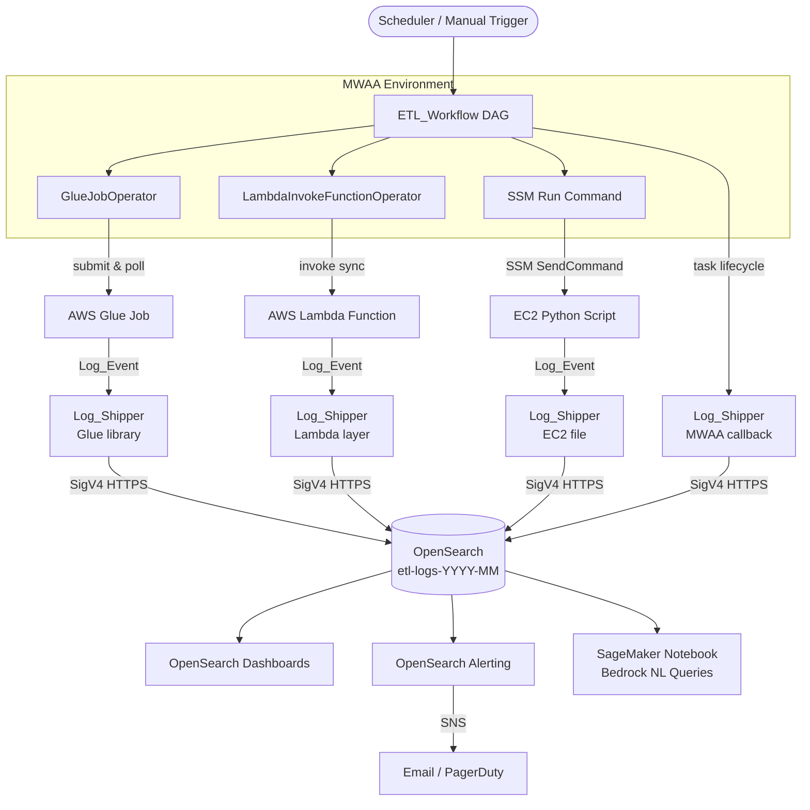

# Monitoring MWAA-Orchestrated ETL Pipelines with Amazon OpenSearch Service

Modern data platforms rarely live in a single service. A typical Amazon Managed Workflows for Apache Airflow (MWAA)-orchestrated ETL pipeline might kick off an AWS Glue job to extract and transform terabytes of raw data, invoke an AWS Lambda function for lightweight event-driven processing, and then hand off to a Python script running on an Amazon EC2 instance for custom, stateful computation. Each of those components writes logs — but to completely different places.

The result is that when a pipeline run fails at 2 AM, the on-call engineer has to open four or five browser tabs, correlate timestamps manually, and piece together what actually happened. There is no single place to ask "show me everything that happened during run `scheduled__2024-03-15T10:00:00+00:00`."

This post solves that problem by centralizing structured log events from every pipeline component into a single Amazon OpenSearch Service index. Every component — MWAA DAG callbacks, Glue jobs, Lambda functions, and EC2 scripts — emits a structured JSON document called a `Log_Event` to OpenSearch via a shared Python library called `LogShipper`. Because every `Log_Event` carries the same `run_id` (the Airflow DAG run ID), you can retrieve the complete execution history of any pipeline run with a single query. We also show how to query those logs using natural language through Amazon Bedrock and the OpenSearch MCP Server.

## Solution overview

The walkthrough includes the following steps:

1. Deploy the infrastructure using the provided AWS CloudFormation template
2. Configure the OpenSearch index mapping and retention policy
3. Deploy the shared `LogShipper` library to each compute environment
4. Instrument the MWAA DAG with callbacks and `run_id` propagation
5. Configure OpenSearch Dashboards, alerting, and anomaly detection
6. Query logs using natural language from a SageMaker notebook

## Architecture overview

The diagram below shows how log events flow from each pipeline component to OpenSearch and then to dashboards and alerts.



**MWAA DAG** orchestrates the three downstream tasks and ships task lifecycle events to OpenSearch via `on_failure_callback` and `on_success_callback`.

**AWS Glue** handles large-scale data extraction and transformation. The Glue script imports `LogShipper` and ships a terminal `Log_Event` when the job succeeds or fails.

**AWS Lambda** handles lightweight, event-driven processing. `LogShipper` is instantiated once at module scope so credentials are reused across warm invocations.

**EC2 Python Script** handles custom, stateful processing. `LogShipper` is installed via `pip` and invoked from the script's `finally` block.

**LogShipper** is the shared library that serializes a `LogEvent` to JSON, signs the HTTP POST request with AWS Signature Version 4 (SigV4), and sends it to the OpenSearch index. It retries up to three times with exponential backoff before raising `LogShipperError`.

**OpenSearch Index (`etl-logs-YYYY-MM`)** is the central log store. Indices are named by month so the ISM retention policy can delete entire indices after 30 days without scanning individual documents.

**SageMaker Notebook** uses Amazon Bedrock (Claude 3 Haiku) to translate plain English questions into OpenSearch DSL queries and summarize the results.

### Why SigV4 authentication?

This solution uses IAM-based SigV4 authentication exclusively. There are no usernames or passwords to store, rotate, or accidentally commit to source control. Each compute role gets exactly `es:ESHttpPost` on the specific index ARN. Every request is signed with the caller's IAM identity, so AWS CloudTrail records which role shipped each log event.

### The `run_id` correlation key

Every `Log_Event` document carries a `run_id` field set to the Airflow DAG run ID (for example, `scheduled__2024-03-15T10:00:00+00:00`). The MWAA DAG passes this value to each downstream task via Jinja templating (`{{ run_id }}`). This means you can retrieve every log event from a single pipeline run — across Glue, Lambda, EC2, and MWAA — with a single `term` query on `run_id`. No timestamp correlation, no log group hunting.

## Prerequisites

To follow this walkthrough, you need:

- An AWS account with permissions to create IAM roles, OpenSearch domains, MWAA environments, Glue jobs, Lambda functions, EC2 instances, SageMaker notebook instances, and Secrets Manager secrets
- The AWS CLI installed and configured with credentials
- `awscurl` installed (`pip install awscurl`) for SigV4-signed OpenSearch API calls
- A VPC with at least two private subnets (required by MWAA) and one public subnet. If your default VPC only has public subnets, see the CloudFormation template notes for creating private subnets with a NAT Gateway.
- Amazon Bedrock model access enabled for `anthropic.claude-3-haiku-20240307-v1:0` in your region

The following Python packages are required across compute environments:

| Package | Version | Purpose |
|---|---|---|
| `requests-aws4auth` | `==1.3.1` | SigV4 request signing |
| `boto3` | `>=1.34.0` | AWS SDK |
| `requests` | `>=2.31.0` | HTTP client |
| `apache-airflow-providers-amazon` | `>=8.0.0` | Glue, Lambda, SSM operators |

## Deploy the infrastructure

The provided CloudFormation template (`infra/cloudformation.yaml`) deploys all required resources in a single stack: OpenSearch domain, S3 bucket, SNS topic, Secrets Manager secret, IAM roles, Lambda function, Glue job, EC2 instance, MWAA environment, and SageMaker notebook instance.

**Step 1.** Clone the repository:

```bash
git clone git@ssh.gitlab.aws.dev:bjurstro/MWAA_Observability_Blog.git
cd MWAA_Observability_Blog
```

**Step 2.** Upload the Glue script and DAG files to S3 before deploying the stack (the stack references these paths):

```bash
BUCKET="etl-monitoring-$(aws sts get-caller-identity --query Account --output text)"
aws s3 mb s3://$BUCKET --region us-east-1
aws s3 cp infra/etl_glue_job_mwaa.py s3://$BUCKET/glue/etl_glue_job.py
aws s3 cp infra/etl_workflow_dag_mwaa.py s3://$BUCKET/dags/etl_workflow_dag.py
aws s3 cp infra/dag_callbacks_mwaa.py s3://$BUCKET/dags/dag_callbacks.py
aws s3 cp infra/log_shipper_mwaa.py s3://$BUCKET/dags/log_shipper.py
aws s3 cp blog/code/log_event.py s3://$BUCKET/dags/log_event.py
aws s3 cp infra/requirements.txt s3://$BUCKET/requirements.txt
aws s3 cp notebooks/etl_log_analysis.ipynb s3://$BUCKET/notebooks/etl_log_analysis.ipynb
```

**Step 3.** Deploy the CloudFormation stack. Replace the subnet and VPC IDs with your own values:

```bash
aws cloudformation deploy \
  --template-file infra/cloudformation.yaml \
  --stack-name etl-monitoring \
  --capabilities CAPABILITY_NAMED_IAM \
  --parameter-overrides \
    EnvironmentName=etl-monitoring \
    VpcId=vpc-XXXXXXXX \
    PrivateSubnet1=subnet-XXXXXXXX \
    PrivateSubnet2=subnet-YYYYYYYY \
    PublicSubnet1=subnet-ZZZZZZZZ \
    GlueScriptS3Path=s3://$BUCKET/glue/etl_glue_job.py \
    NotificationEmail=your@email.com \
  --region us-east-1
```

The stack takes approximately 25–30 minutes to complete (MWAA environment provisioning is the longest step).

**Step 4.** After the stack completes, retrieve the OpenSearch endpoint and update the Secrets Manager secret:

```bash
OS_ENDPOINT=$(aws cloudformation describe-stacks \
  --stack-name etl-monitoring \
  --query "Stacks[0].Outputs[?OutputKey=='OpenSearchEndpoint'].OutputValue" \
  --output text)

SECRET_ARN=$(aws cloudformation describe-stacks \
  --stack-name etl-monitoring \
  --query "Stacks[0].Outputs[?OutputKey=='SecretsManagerSecretArn'].OutputValue" \
  --output text)

aws secretsmanager update-secret \
  --secret-id $SECRET_ARN \
  --secret-string "{\"opensearch_endpoint\": \"$OS_ENDPOINT\"}"
```

> **Note:** MWAA requires private subnets. If your default VPC only has public subnets, create two private subnets with a NAT Gateway before deploying. See the troubleshooting section for the CLI commands.

## Configure the OpenSearch index

**Step 5.** Create the monthly index with the field mapping. Run this at the start of each month:

```bash
awscurl --service es --region us-east-1 \
  -X PUT \
  -H "Content-Type: application/json" \
  -d @blog/config/index_mapping.json \
  "$OS_ENDPOINT/etl-logs-$(date +%Y-%m)"
```

The mapping uses `keyword` type for all identifier fields (`run_id`, `task_name`, `component_type`, `log_level`) to enable exact-match filtering and aggregations, `text` for `message` to enable full-text search, `date` for timestamp fields, and `long` for `duration_ms` to accommodate multi-hour Glue jobs.

The mapping also sets `"dynamic": "strict"` to reject any document that contains a field not declared in the mapping. This prevents schema drift and catches bugs in the `LogEvent` dataclass early.

**Step 6.** Apply the ISM 30-day retention policy:

```bash
awscurl --service es --region us-east-1 \
  -X PUT \
  -H "Content-Type: application/json" \
  -d @blog/config/ism_policy.json \
  "$OS_ENDPOINT/_plugins/_ism/policies/etl-logs-retention"
```

The ISM policy automatically attaches to every new `etl-logs-*` index via the `ism_template` block. No manual attachment is needed when a new monthly index is created.

## Deploy the LogShipper library

The `LogShipper` class (`blog/code/log_shipper.py`) delivers `LogEvent` documents to OpenSearch using SigV4 authentication. It retries up to four total attempts (1 initial + 3 retries) with exponential backoff delays of 1 s, 2 s, and 4 s. On final failure it raises `LogShipperError` and emits an error message to stderr.

The OpenSearch endpoint is retrieved from AWS Secrets Manager at runtime — never from environment variables, DAG code, or source control.

**Step 7 — Deploy to AWS Glue.** Add the dependencies to the Glue job's `--additional-python-modules` parameter and upload the script to S3:

```bash
aws s3 cp infra/etl_glue_job_mwaa.py s3://$BUCKET/glue/etl_glue_job.py
```

The Glue job is already configured in the CloudFormation stack with `requests==2.31.0,requests-aws4auth==1.3.1` in `--additional-python-modules`.

**Step 8 — Deploy to AWS Lambda.** The Lambda function is deployed by the CloudFormation stack. To update it with the full handler:

```bash
mkdir -p /tmp/lambda_pkg/plugins/log_shipper
cp blog/code/log_event.py /tmp/lambda_pkg/
cp code/lambda/handler.py /tmp/lambda_pkg/
cp code/plugins/log_shipper/*.py /tmp/lambda_pkg/plugins/log_shipper/
touch /tmp/lambda_pkg/plugins/__init__.py /tmp/lambda_pkg/plugins/log_shipper/__init__.py
pip install requests==2.31.0 requests-aws4auth==1.3.1 -t /tmp/lambda_pkg/ -q
cd /tmp/lambda_pkg && zip -r /tmp/etl_lambda.zip . -q

FUNCTION_NAME=$(aws cloudformation describe-stacks \
  --stack-name etl-monitoring \
  --query "Stacks[0].Outputs[?OutputKey=='LambdaFunctionArn'].OutputValue" \
  --output text | cut -d: -f7)

aws lambda update-function-code \
  --function-name $FUNCTION_NAME \
  --zip-file fileb:///tmp/etl_lambda.zip
```

**Step 9 — Deploy to EC2.** The EC2 instance is provisioned by the CloudFormation stack with a user data script that downloads the ETL files from S3. Upload the files first:

```bash
EC2_ID=$(aws cloudformation describe-stacks \
  --stack-name etl-monitoring \
  --query "Stacks[0].Outputs[?OutputKey=='EC2InstanceId'].OutputValue" \
  --output text)

aws s3 cp code/ec2/custom_script.py s3://$BUCKET/ec2/custom_script.py
aws s3 cp code/plugins/log_shipper/models.py s3://$BUCKET/ec2/plugins/log_shipper/models.py
aws s3 cp code/plugins/log_shipper/log_shipper.py s3://$BUCKET/ec2/plugins/log_shipper/log_shipper.py
aws s3 cp code/plugins/log_shipper/exceptions.py s3://$BUCKET/ec2/plugins/log_shipper/exceptions.py
```

**Step 10 — Deploy to MWAA.** The DAG files are already uploaded in Step 2. Upload the requirements file:

```bash
aws s3 cp infra/requirements.txt s3://$BUCKET/requirements.txt
```

> **Important:** When deploying to MWAA, use the files in `infra/` (not `blog/code/`). The `infra/` versions use flat imports (`from log_event import ...`) because MWAA places all DAG files in the same flat `dags/` folder. The `blog/code/` versions use `blog.code.*` package paths for local development and testing.

## Instrument the MWAA DAG

The DAG (`infra/etl_workflow_dag_mwaa.py`) orchestrates the three tasks in sequence: `glue_extraction` → `lambda_transform` → `ec2_custom_script`.

**Step 11.** Set the required Airflow Variables in the MWAA UI. Open the Airflow UI from the AWS Console (MWAA → your environment → **Open Airflow UI**), then go to **Admin → Variables → +**:

| Key | Value |
|---|---|
| `opensearch_secret_name` | `etl-monitoring/opensearch/endpoint` |
| `opensearch_index_name` | `etl-logs-YYYY-MM` (current month) |
| `aws_region` | `us-east-1` |
| `sns_failure_topic_arn` | (from CloudFormation output `SNSTopicArn`) |
| `glue_job_name` | `etl-monitoring-extraction-job` |
| `lambda_function_name` | `etl-monitoring-transform` |
| `ec2_instance_id` | (from CloudFormation output `EC2InstanceId`) |

### How `{{ run_id }}` flows through the pipeline

Airflow's `{{ run_id }}` Jinja template variable resolves to the DAG run ID at execution time. The DAG passes it to each downstream task differently:

- **Glue** — via `script_args["--run_id"]`, which `getResolvedOptions` reads as a CLI argument
- **Lambda** — embedded in the JSON `payload` string, which the handler reads from `event["run_id"]`
- **EC2** — exported as the `RUN_ID` environment variable in the SSM Run Command

Because all three compute components receive the same `run_id` value, every `Log_Event` they ship to OpenSearch carries the same correlation key.

### Failure and success callbacks

`notify_failure` is attached to every task via `default_args["on_failure_callback"]`. It fires when a task exhausts all retries and transitions to the `failed` state. It publishes an SNS notification and ships a `Log_Event` with `log_level: ERROR` to OpenSearch. Both calls are wrapped in `try/except` so that a notification failure does not mask the original pipeline failure.

`write_dag_summary` is attached at the DAG level via `on_success_callback`. It fires once the final task succeeds and ships a summary `Log_Event` with `log_level: INFO` containing the total DAG run duration and per-task terminal states.

## Configure OpenSearch Dashboards and alerting

**Step 12.** Create the index pattern. Open OpenSearch Dashboards at `$OS_ENDPOINT/_dashboards`, then go to **Stack Management → Index Patterns → Create index pattern**. Set the pattern to `etl-logs-*` and the time field to `timestamp`.

**Step 13.** Create the SNS notification channel for alerting. OpenSearch 2.x uses the Notifications plugin instead of the legacy Destinations API:

```bash
awscurl --service es --region us-east-1 \
  -X POST \
  -H "Content-Type: application/json" \
  -d "{\"config\":{\"name\":\"ETL Failures SNS\",\"config_type\":\"sns\",\"is_enabled\":true,\"sns\":{\"topic_arn\":\"$(aws cloudformation describe-stacks --stack-name etl-monitoring --query 'Stacks[0].Outputs[?OutputKey==\`SNSTopicArn\`].OutputValue' --output text)\",\"role_arn\":\"$(aws iam get-role --role-name etl-monitoring-OpenSearchAlertingRole --query 'Role.Arn' --output text)\"}}}" \
  "$OS_ENDPOINT/_plugins/_notifications/configs"
```

Note the `config_id` from the response. Update `blog/config/alert_monitor.json` by replacing `"sns-destination-placeholder"` with that ID, then apply the monitor:

```bash
awscurl --service es --region us-east-1 \
  -X POST \
  -H "Content-Type: application/json" \
  -d @blog/config/alert_monitor.json \
  "$OS_ENDPOINT/_plugins/_alerting/monitors"
```

The monitor checks every 5 minutes and fires when the count of `log_level: ERROR` events exceeds 5 in the rolling window.

**Step 14.** Build the pipeline health dashboard. Create a new dashboard with the following panels:

- **Events by log level (time series)** — date histogram on `timestamp`, split series by `log_level`
- **Recent DAG runs (data table)** — terms aggregation on `run_id`, ordered by `timestamp` descending
- **Average task duration by component (bar chart)** — terms aggregation on `component_type`, Y-axis `avg(duration_ms)`

Use the DSL queries in `blog/config/` to drill down from a failed run to the specific `Log_Events` that caused the failure. Filter the dashboard by `run_id` to see the complete execution history of any single pipeline run.

## Query logs with natural language

Once your `Log_Events` are flowing into OpenSearch, you can query them using natural language through two approaches.

### Option 1: OpenSearch MCP Server (for AI assistants)

The [OpenSearch MCP Server](https://github.com/opensearch-project/opensearch-mcp-server-py) exposes your OpenSearch cluster as a set of tools that any MCP-compatible AI assistant can call. Add the following to your MCP client configuration:

```json
{
  "mcpServers": {
    "opensearch-mcp": {
      "command": "uvx",
      "args": ["opensearch-mcp-server-py@latest"],
      "env": {
        "OPENSEARCH_URL": "https://YOUR-OPENSEARCH-ENDPOINT",
        "AWS_REGION": "us-east-1",
        "OPENSEARCH_AUTH_TYPE": "awssigv4",
        "OPENSEARCH_SERVICE": "es"
      }
    }
  }
}
```

Once connected, you can ask questions like:

- *"Show me all ERROR events from the last hour"*
- *"What is the average duration for each component type?"*
- *"Which tasks failed in the most recent DAG run?"*

### Option 2: SageMaker notebook with Amazon Bedrock

The provided notebook (`notebooks/etl_log_analysis.ipynb`) uses Claude 3 Haiku to translate plain English questions into DSL queries, execute them against OpenSearch, and summarize the results.

**Step 15.** Open the SageMaker notebook. Go to the AWS Console → SageMaker → Notebook instances → **etl-monitoring-log-analysis** → **Open JupyterLab**. Upload `notebooks/etl_log_analysis.ipynb` and run the cells top to bottom.

The notebook's `natural_language_query()` function works as follows:

1. Sends your question to Claude 3 Haiku with the `Log_Event` schema as context
2. Claude generates a valid OpenSearch DSL query
3. The query is executed against your `etl-logs-*` index using SigV4 authentication
4. Claude summarizes the results in plain English

Example output for the question *"What insights can be generated from my most recent DAG run?"*:

```
Run ID: manual__2026-04-24T14:16:54.328819+00:00
Overall status: Success

Task Performance:
- lambda_transform: 0 ms (placeholder logic — no real transformation yet)
- ec2_custom_script: 7–13 ms (exit_code=0, script ran successfully)

Observations:
- Lambda duration is 0 ms — add real transformation logic to get meaningful metrics
- EC2 script ran twice in one run — deduplicate SSM command IDs to prevent this
- instance_id shows as 'unknown' — pass instance ID explicitly via SSM environment variable
- No Glue Log_Event found — requests-aws4auth install timing issue in Python shell environment
```

## Verify end-to-end

**Step 16.** Trigger a test DAG run from the Airflow UI. Go to **DAGs → etl_workflow → ▶ Trigger DAG**.

**Step 17.** Query OpenSearch to confirm events are flowing:

```bash
awscurl --service es --region us-east-1 \
  -X POST \
  -H "Content-Type: application/json" \
  -d '{"query":{"match_all":{}},"size":10,"sort":[{"timestamp":{"order":"desc"}}]}' \
  "$OS_ENDPOINT/etl-logs-$(date +%Y-%m)/_search"
```

You should see `Log_Event` documents from `lambda` and `ec2` component types with `log_level: INFO`, and any task failures captured as `mwaa` component type with `log_level: ERROR`.

## Troubleshooting

| Issue | Likely cause | Resolution |
|---|---|---|
| Log_Events not appearing in OpenSearch | IAM role missing `es:ESHttpPost`, wrong index name, or wrong endpoint | Check `LogShipper` logs for HTTP 403. Verify the IAM policy ARN matches the domain ARN exactly. |
| SigV4 authentication errors | `requests-aws4auth` not installed, wrong region, or IAM role not attached | Confirm `requests-aws4auth==1.3.1` is installed. Verify the `region` matches the OpenSearch domain region. |
| OpenSearch index mapping conflicts | Field type mismatch | Delete and recreate the index with `blog/config/index_mapping.json`. |
| MWAA DAG broken — `ModuleNotFoundError: No module named 'blog'` | DAG files use `blog.code.*` imports | Use the MWAA-compatible files in `infra/` which use flat imports. |
| MWAA DAG broken — `SsmRunCommandOperator` not found | Operator not available in installed provider version | Use `PythonOperator` + `boto3` SSM client (already done in `infra/etl_workflow_dag_mwaa.py`). |
| MWAA DAG broken — `poll_interval` invalid argument | `GlueJobOperator` version doesn't support this parameter | Remove `poll_interval` from `GlueJobOperator` constructor. |
| MWAA webserver link gives "permission" error | Login token expired (60-second TTL) | Use the AWS Console → MWAA → **Open Airflow UI** button instead. |
| OpenSearch Dashboards "anonymous user" error | Browser access not allowed by domain access policy | Add your IP to the OpenSearch access policy. |
| Destinations API returns 405 | OpenSearch 2.x uses Notifications plugin | Use `_plugins/_notifications/configs` endpoint instead. |
| MWAA environment creation fails — "subnets must be private" | Default VPC only has public subnets | Create private subnets with a NAT Gateway before deploying. |

## Conclusion

By centralizing structured log events from MWAA, Glue, Lambda, and EC2 into a single Amazon OpenSearch Service index, you gain full observability over your distributed ETL pipeline from a single pane of glass. The `run_id` correlation key ties every log event from a single pipeline run together, so investigating a failure takes one query instead of five browser tabs.

The solution delivers:

- A shared `LogEvent` schema and `LogShipper` library deployable to all four compute environments with no username or password credentials
- A 30-day ISM retention policy that manages index lifecycle automatically
- OpenSearch Dashboards panels for time-series error rates, run-level tables, and duration histograms
- An alerting monitor that fires SNS notifications when error counts spike, complementing the MWAA `on_failure_callback` for immediate task-level alerts
- Natural language log querying via the OpenSearch MCP Server and a SageMaker notebook powered by Amazon Bedrock

**Suggested next steps:**

- Enable OpenSearch anomaly detection on `duration_ms` to catch gradual performance degradation before it becomes a pipeline failure
- Extend the solution to cross-account log aggregation by granting `es:ESHttpPost` to IAM roles in source accounts
- Explore OpenSearch ML Commons for semantic anomaly detection on the `message` field

If you have questions or feedback, leave a comment below. For additional discussion, visit the [OpenSearch Community](https://forum.opensearch.org/).

## Clean up

When you are done with the solution, delete the resources below to stop incurring charges. The resources are listed in the order that minimizes dependency conflicts.

**Step 1 — Stop the SageMaker notebook instance.**

A running notebook instance incurs charges even when idle. Stop it first:

```bash
aws sagemaker stop-notebook-instance \
  --notebook-instance-name etl-monitoring-log-analysis \
  --region us-east-1
```

To delete it entirely:

```bash
aws sagemaker delete-notebook-instance \
  --notebook-instance-name etl-monitoring-log-analysis \
  --region us-east-1
```

**Step 2 — Delete the MWAA environment.**

MWAA is the most expensive resource in this stack. Deleting it takes approximately 20 minutes:

```bash
aws mwaa delete-environment \
  --name etl-monitoring-mwaa \
  --region us-east-1
```

**Step 3 — Empty the S3 bucket.**

CloudFormation cannot delete a non-empty S3 bucket. Empty it first:

```bash
BUCKET="etl-monitoring-$(aws sts get-caller-identity --query Account --output text)"
aws s3 rm s3://$BUCKET --recursive
```

**Step 4 — Delete the CloudFormation stack.**

This removes all remaining resources created by the stack — OpenSearch domain, Lambda function, Glue job, EC2 instance, IAM roles, SNS topic, Secrets Manager secret, and security group:

```bash
aws cloudformation delete-stack \
  --stack-name etl-monitoring \
  --region us-east-1
```

Monitor the deletion progress:

```bash
aws cloudformation wait stack-delete-complete \
  --stack-name etl-monitoring \
  --region us-east-1
echo "Stack deleted"
```

**Step 5 — Delete the S3 bucket.**

Once the stack is deleted, remove the bucket itself:

```bash
aws s3 rb s3://$BUCKET --force
```

**Step 6 — Release the Elastic IP (if you created private subnets manually).**

If you created a NAT Gateway outside of CloudFormation, release the associated Elastic IP to avoid charges:

```bash
# Find the allocation ID
aws ec2 describe-addresses --region us-east-1 \
  --query "Addresses[?Tags[?Key=='Name' && Value=='mwaa-nat-gw']].AllocationId" \
  --output text

# Release it
aws ec2 release-address --allocation-id eipalloc-XXXXXXXXXX --region us-east-1
```

**Step 7 — Verify no resources remain.**

Confirm the OpenSearch domain and MWAA environment are gone:

```bash
aws opensearch list-domain-names --region us-east-1
aws mwaa list-environments --region us-east-1
```

Both should return empty lists.

> **Cost note:** The OpenSearch domain (`t3.medium.search`, 20 GB gp3) costs approximately $0.07/hour. The MWAA environment (`mw1.small`) costs approximately $0.49/hour plus worker costs. The NAT Gateway costs approximately $0.045/hour plus data processing charges. Deleting these resources promptly after completing the walkthrough avoids unexpected charges.

## About the authors

**Sean Bjurstrom** is a Technical Account Manager in ISV accounts at Amazon Web Services, where he specializes in analytics technologies and draws on his background in consulting to support customers on their analytics and cloud journeys. Sean is passionate about helping businesses harness the power of data to drive innovation and growth. Outside of work, he enjoys running and has participated in several marathons.
