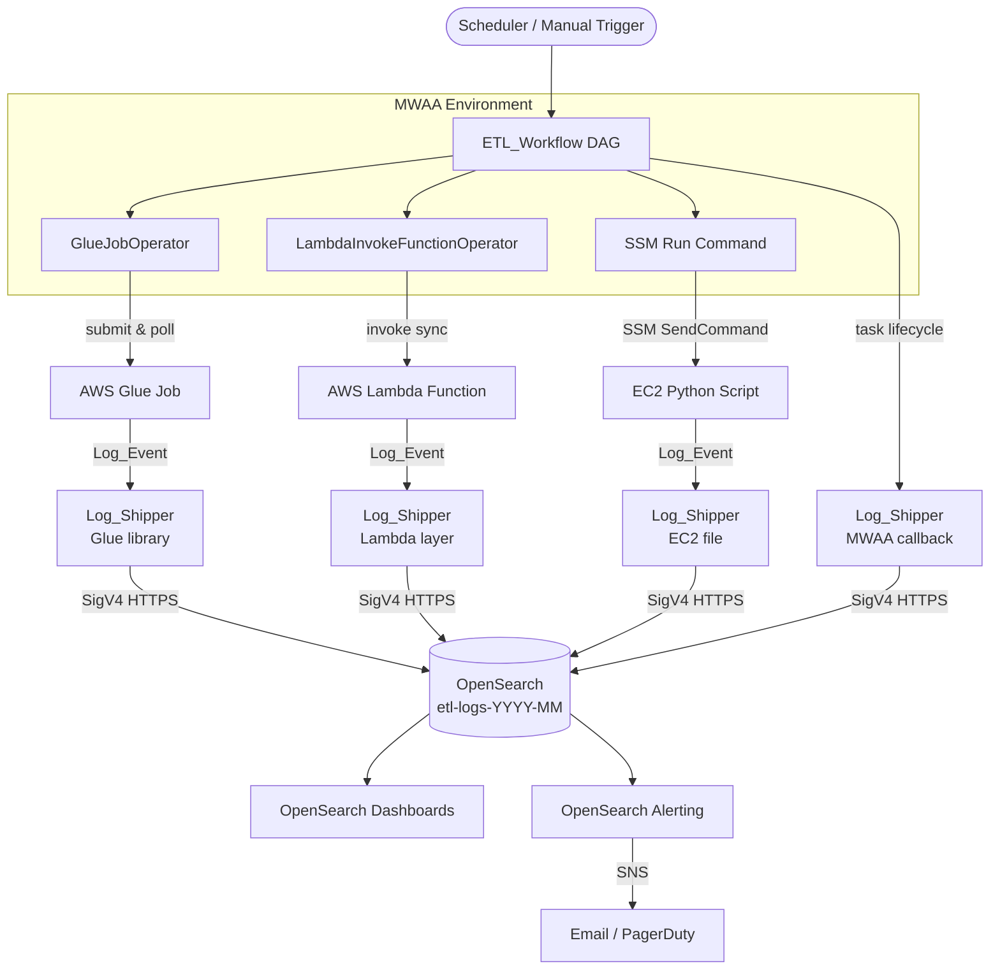

### Authors 
- Sean Bjurstrom @bjurstro 
- Anupa Bhattacharyya @bhattace

# Monitoring MWAA-Orchestrated ETL Pipelines with Amazon OpenSearch Service

---

## 1. Introduction

Modern data platforms rarely live in a single service. A typical MWAA-orchestrated ETL pipeline might kick off an AWS Glue job to extract and transform terabytes of raw data, invoke a Lambda function for lightweight event-driven processing, and then hand off to a Python script running on an EC2 instance for custom, stateful computation. Each of those components writes logs — but to completely different places. Glue logs land in CloudWatch Logs and the Glue console. Lambda execution logs go to CloudWatch Logs under a function-specific log group. EC2 scripts write to wherever the script author decided to send stdout. MWAA task logs are accessible through the Airflow UI or, if you've configured log shipping, in yet another CloudWatch log group.

The result is that when a pipeline run fails at 2 AM, the on-call engineer has to open four or five browser tabs, correlate timestamps manually, and piece together what actually happened. There is no single place to ask "show me everything that happened during run `scheduled__2024-03-15T10:00:00+00:00`."

This blog post solves that problem by centralizing structured log events from every pipeline component into a single Amazon OpenSearch Service index. Every component — MWAA DAG callbacks, Glue jobs, Lambda functions, and EC2 scripts — emits a structured JSON document called a `Log_Event` to OpenSearch via a shared Python library called `LogShipper`. Because every `Log_Event` carries the same `run_id` (the Airflow DAG run ID), you can retrieve the complete execution history of any pipeline run with a single query.

By the end of this guide you will have:

- A shared `LogEvent` dataclass and `LogShipper` library deployable to all four compute environments
- An OpenSearch index with an explicit field mapping and a 30-day ISM retention policy
- An instrumented MWAA DAG that passes `run_id` to every downstream task
- OpenSearch Dashboards panels for pipeline health, error rates, and task durations
- An alerting monitor that fires an SNS notification when error counts spike
- Least-privilege IAM policies for each compute role

---

## 2. Architecture Overview

### End-to-End Monitoring Flow

The diagram below shows how log events flow from each pipeline component to OpenSearch and then to dashboards and alerts.



### Component Roles

**MWAA DAG** — The orchestrator. It schedules and monitors the three downstream tasks. DAG-level callbacks (`on_failure_callback`, `on_success_callback`) ship task lifecycle events to OpenSearch so you can see the DAG's perspective alongside the compute components' perspectives.

**AWS Glue Job** — Handles large-scale data extraction and transformation. The Glue script imports `LogShipper` as a Python library (added via `--additional-python-modules`) and ships a terminal `Log_Event` when the job succeeds or fails.

**AWS Lambda Function** — Handles lightweight, event-driven processing. `LogShipper` is packaged as a Lambda layer and instantiated once at module scope (cold-start) so credentials are reused across warm invocations.

**EC2 Python Script** — Handles custom, stateful processing that requires a persistent environment. `LogShipper` is installed via `pip` on the instance and invoked from the script's `finally` block.

**LogShipper** — The shared library that runs in every compute environment. It serializes a `LogEvent` to JSON, signs the HTTP POST request with SigV4, and sends it to the OpenSearch index. It retries up to three times with exponential backoff before raising `LogShipperError`.

**OpenSearch Index (`etl-logs-YYYY-MM`)** — The central log store. Indices are named by month so that the ISM retention policy can delete entire indices after 30 days without needing to delete individual documents.

**OpenSearch Dashboards** — Provides time-series charts, run-level tables, and duration histograms built on top of the `etl-logs-*` indices.

**OpenSearch Alerting → SNS** — Monitors the error count in a rolling window and publishes to an SNS topic when the threshold is exceeded.

### Why SigV4?

OpenSearch Service supports two authentication modes: fine-grained access control with a master user (username/password or IAM), and IAM-based resource policies. This solution uses IAM-based SigV4 authentication exclusively. The reasons are:

1. **No credentials to rotate** — IAM roles are assumed automatically by the compute environment. There is no password to store, rotate, or accidentally commit to source control.
2. **Least-privilege by default** — Each compute role gets exactly `es:ESHttpPost` on the specific index ARN. No role can read, delete, or reconfigure the index.
3. **Audit trail** — Every request is signed with the caller's IAM identity, so CloudTrail records which role shipped each log event.

### The `run_id` Correlation Key

Every `Log_Event` document carries a `run_id` field set to the Airflow DAG run ID (e.g., `scheduled__2024-03-15T10:00:00+00:00`). The MWAA DAG passes this value to each downstream task via Jinja templating (`{{ run_id }}`). This means you can retrieve every log event from a single pipeline run — across Glue, Lambda, EC2, and MWAA — with a single `term` query on `run_id`. No timestamp correlation, no log group hunting.

---

## 3. Prerequisites

### AWS Services

You need the following services active in your AWS account:

- **Amazon MWAA** — managed Airflow environment (Airflow 2.6+)
- **AWS Glue** — for the extraction/transformation job
- **AWS Lambda** — for the lightweight processing function
- **Amazon EC2** — for the custom processing script
- **Amazon OpenSearch Service** — the central log store (OpenSearch 2.x or later)
- **AWS Secrets Manager** — stores the OpenSearch endpoint URL
- **Amazon SNS** — receives alert notifications from OpenSearch Alerting

### IAM Permissions

Each compute role needs the following OpenSearch permission attached:

```json
{
  "Effect": "Allow",
  "Action": ["es:ESHttpPost"],
  "Resource": "arn:aws:es:REGION:ACCOUNT_ID:domain/DOMAIN_NAME/etl-logs-*"
}
```

The MWAA execution role additionally needs `secretsmanager:GetSecretValue` on the secret that stores the OpenSearch endpoint, and `sns:Publish` on the failure notification topic.

### Python Package Versions

All four compute environments must have these packages installed at the pinned versions:

| Package | Version | Purpose |
|---|---|---|
| `requests-aws4auth` | `==1.3.1` | SigV4 request signing |
| `boto3` | `>=1.34.0` | AWS SDK — credentials, Secrets Manager |
| `requests` | `>=2.31.0` | HTTP client used by LogShipper |
| `apache-airflow-providers-amazon` | `>=8.0.0` | Glue, Lambda, SSM operators for MWAA |

---

## 4. Log_Event Schema Design

### The Schema

Every pipeline component emits a `Log_Event` — a flat JSON document with a fixed set of required base fields and component-specific optional fields. The complete JSON Schema is:

```json
{
  "$schema": "http://json-schema.org/draft-07/schema#",
  "type": "object",
  "required": [
    "run_id", "task_name", "component_type",
    "log_level", "message", "timestamp"
  ],
  "properties": {
    "run_id":          { "type": "string", "description": "MWAA DAG run ID — correlation key for all events in a single pipeline run" },
    "task_name":       { "type": "string", "description": "Airflow task_id that produced this event" },
    "component_type":  { "type": "string", "enum": ["glue", "lambda", "ec2", "mwaa"] },
    "log_level":       { "type": "string", "enum": ["INFO", "WARN", "ERROR"] },
    "message":         { "type": "string", "description": "Human-readable description of the event" },
    "timestamp":       { "type": "string", "format": "date-time", "description": "ISO 8601 UTC, e.g. 2024-03-15T10:30:00Z" },
    "job_name":        { "type": "string", "description": "Glue job name (glue only)" },
    "job_run_id":      { "type": "string", "description": "Glue job run ID (glue only)" },
    "terminal_status": { "type": "string", "description": "Glue terminal status: SUCCEEDED | FAILED | STOPPED (glue only)" },
    "function_name":   { "type": "string", "description": "Lambda function name (lambda only)" },
    "request_id":      { "type": "string", "description": "Lambda request ID (lambda only)" },
    "outcome":         { "type": "string", "enum": ["success", "error"], "description": "Lambda invocation outcome (lambda only)" },
    "instance_id":     { "type": "string", "description": "EC2 instance ID (ec2 only)" },
    "script_name":     { "type": "string", "description": "Script filename (ec2 only)" },
    "exit_code":       { "type": "integer", "description": "Script exit code (ec2 only)" },
    "start_time":      { "type": "string", "format": "date-time" },
    "end_time":        { "type": "string", "format": "date-time" },
    "duration_ms":     { "type": "integer", "description": "Duration in milliseconds" }
  }
}
```

### Required Base Fields

| Field | Type | Purpose |
|---|---|---|
| `run_id` | string | The Airflow DAG run ID. This is the correlation key — every event from a single pipeline run carries the same value. |
| `task_name` | string | The Airflow `task_id` that produced this event (e.g., `"glue_extraction"`). |
| `component_type` | enum | The compute environment: `"glue"`, `"lambda"`, `"ec2"`, or `"mwaa"`. Used for filtering and aggregations. |
| `log_level` | enum | Severity: `"INFO"` for normal completion, `"WARN"` for recoverable issues, `"ERROR"` for failures. |
| `message` | string | Human-readable description. This is the only field mapped as `text` in OpenSearch, enabling full-text search. |
| `timestamp` | ISO 8601 UTC | When the event occurred. Must be UTC (e.g., `"2024-03-15T10:30:00Z"`). OpenSearch uses this as the primary time field for the Dashboards time picker and range queries. |

### Component-Specific Optional Fields

**Glue** — `job_name` (the Glue job name), `job_run_id` (the Glue job run ID, useful for correlating with the Glue console), `terminal_status` (`SUCCEEDED`, `FAILED`, or `STOPPED`).

**Lambda** — `function_name` (the Lambda function name), `request_id` (the Lambda request ID, useful for correlating with CloudWatch Logs), `outcome` (`"success"` or `"error"`), `duration_ms` (invocation duration in milliseconds).

**EC2** — `instance_id` (the EC2 instance ID), `script_name` (the script filename), `exit_code` (POSIX exit code; 0 = success).

**Shared timing fields** — `start_time`, `end_time`, `duration_ms` are available to all component types and enable duration-based aggregations and SLA monitoring.

### The `log_level` Enum

Use `"INFO"` when a task completes normally. Use `"WARN"` when a task completes but encountered a recoverable issue (e.g., a retry succeeded, or a non-critical data quality check failed). Use `"ERROR"` when a task fails and will not be retried. The OpenSearch alerting monitor in Section 9 triggers on `log_level: ERROR` events, so consistent use of this enum is important.

### Why ISO 8601 UTC for Timestamps?

OpenSearch maps `timestamp`, `start_time`, and `end_time` as `date` fields, which are stored internally as epoch milliseconds. This enables efficient range queries (`"gte": "2024-03-15T00:00:00Z"`) and time-series aggregations. Using UTC consistently across all components avoids timezone ambiguity when correlating events from Glue (which runs in a managed environment), Lambda (which uses UTC by default), and EC2 (which may have a local timezone configured).

### Example Log_Event Documents

**Glue job — successful extraction:**

```json
{
  "run_id": "scheduled__2024-03-15T10:00:00+00:00",
  "task_name": "glue_extraction",
  "component_type": "glue",
  "log_level": "INFO",
  "message": "Glue job completed successfully",
  "timestamp": "2024-03-15T10:28:45Z",
  "job_name": "etl-extraction-job",
  "job_run_id": "jr_abc123def456",
  "terminal_status": "SUCCEEDED",
  "start_time": "2024-03-15T10:00:12Z",
  "end_time": "2024-03-15T10:28:45Z",
  "duration_ms": 1713000
}
```

**Lambda function — successful transformation:**

```json
{
  "run_id": "scheduled__2024-03-15T10:00:00+00:00",
  "task_name": "lambda_transform",
  "component_type": "lambda",
  "log_level": "INFO",
  "message": "Lambda function completed successfully",
  "timestamp": "2024-03-15T10:29:03Z",
  "function_name": "etl-transform-function",
  "request_id": "a1b2c3d4-e5f6-7890-abcd-ef1234567890",
  "outcome": "success",
  "start_time": "2024-03-15T10:28:47Z",
  "end_time": "2024-03-15T10:29:03Z",
  "duration_ms": 16000
}
```

**EC2 script — successful custom processing:**

```json
{
  "run_id": "scheduled__2024-03-15T10:00:00+00:00",
  "task_name": "ec2_custom_script",
  "component_type": "ec2",
  "log_level": "INFO",
  "message": "EC2 script completed successfully",
  "timestamp": "2024-03-15T10:45:22Z",
  "instance_id": "i-0abc123def456789",
  "script_name": "custom_script.py",
  "exit_code": 0,
  "start_time": "2024-03-15T10:29:05Z",
  "end_time": "2024-03-15T10:45:22Z",
  "duration_ms": 977000
}
```

**MWAA DAG — run summary:**

```json
{
  "run_id": "scheduled__2024-03-15T10:00:00+00:00",
  "task_name": "dag_summary",
  "component_type": "mwaa",
  "log_level": "INFO",
  "message": "DAG run completed successfully",
  "timestamp": "2024-03-15T10:45:30Z",
  "overall_status": "success",
  "start_time": "2024-03-15T10:00:00Z",
  "end_time": "2024-03-15T10:45:30Z",
  "duration_ms": 2730000,
  "task_statuses": {
    "glue_extraction": "success",
    "lambda_transform": "success",
    "ec2_custom_script": "success"
  }
}
```

### The `LogEvent` Dataclass

The Python implementation of the schema is a `dataclass` in `log_event.py`. It validates all fields in `__post_init__` and serializes to a JSON-compatible dict via `to_dict()`, omitting `None` fields so that component-specific optional fields don't appear in documents from other component types.

```python
"""
log_event.py — Shared LogEvent dataclass for the MWAA + OpenSearch monitoring blog.

Represents a single structured log document written to the OpenSearch ``etl-logs-YYYY-MM``
index.  Every pipeline component (MWAA DAG, Glue job, Lambda function, EC2 script) creates
``LogEvent`` instances and forwards them to OpenSearch via the ``LogShipper`` class.

Compatible with Python 3.9+.
"""

from __future__ import annotations

import re
from dataclasses import dataclass, field, fields
from datetime import datetime, timezone
from typing import Any, Dict, Optional

# ---------------------------------------------------------------------------
# Constants
# ---------------------------------------------------------------------------

VALID_COMPONENT_TYPES = frozenset({"glue", "lambda", "ec2", "mwaa"})
VALID_LOG_LEVELS = frozenset({"INFO", "WARN", "ERROR"})

# Matches ISO 8601 UTC strings such as:
#   2024-03-15T10:30:00Z
#   2024-03-15T10:30:00.123Z
#   2024-03-15T10:30:00+00:00
_ISO8601_UTC_RE = re.compile(
    r"^\d{4}-\d{2}-\d{2}T\d{2}:\d{2}:\d{2}"  # date + time
    r"(\.\d+)?"                                 # optional fractional seconds
    r"(Z|[+-]00:00)$"                           # UTC offset
)


def _validate_iso8601_utc(value: str, field_name: str) -> None:
    """Raise ``ValueError`` if *value* is not a valid ISO 8601 UTC string."""
    if not isinstance(value, str):
        raise ValueError(
            f"'{field_name}' must be a string, got {type(value).__name__!r}"
        )
    if not _ISO8601_UTC_RE.match(value):
        raise ValueError(
            f"'{field_name}' must be an ISO 8601 UTC string "
            f"(e.g. '2024-03-15T10:30:00Z'), got {value!r}"
        )


def _parse_iso8601(value: str) -> datetime:
    """Parse an ISO 8601 UTC string into a timezone-aware ``datetime``."""
    # Normalise the trailing 'Z' to '+00:00' for fromisoformat (Python 3.9 compat)
    normalised = value.replace("Z", "+00:00")
    return datetime.fromisoformat(normalised)


# ---------------------------------------------------------------------------
# Dataclass
# ---------------------------------------------------------------------------


@dataclass
class LogEvent:
    """Structured log event document for the ETL pipeline monitoring solution.

    Required base fields
    --------------------
    run_id : str
        MWAA DAG run ID — the correlation key that links every log event from a
        single pipeline run across all compute components.
    task_name : str
        Airflow ``task_id`` that produced this event (e.g. ``"glue_extraction"``).
    component_type : str
        The compute environment that emitted the event.  Must be one of
        ``"glue"``, ``"lambda"``, ``"ec2"``, or ``"mwaa"``.
    log_level : str
        Severity level.  Must be one of ``"INFO"``, ``"WARN"``, or ``"ERROR"``.
    message : str
        Human-readable description of the event.
    timestamp : str
        ISO 8601 UTC string representing when the event occurred
        (e.g. ``"2024-03-15T10:30:00Z"``).

    Component-specific optional fields
    ------------------------------------
    Glue:
        job_name, job_run_id, terminal_status
    Lambda:
        function_name, request_id, outcome, duration_ms
    EC2:
        instance_id, script_name, exit_code
    Shared timing / duration:
        start_time, end_time, duration_ms
    """

    # ------------------------------------------------------------------
    # Required base fields
    # ------------------------------------------------------------------
    run_id: str
    task_name: str
    component_type: str
    log_level: str
    message: str
    timestamp: str

    # ------------------------------------------------------------------
    # Glue-specific optional fields
    # ------------------------------------------------------------------
    job_name: Optional[str] = field(default=None)
    job_run_id: Optional[str] = field(default=None)
    terminal_status: Optional[str] = field(default=None)

    # ------------------------------------------------------------------
    # Lambda-specific optional fields
    # ------------------------------------------------------------------
    function_name: Optional[str] = field(default=None)
    request_id: Optional[str] = field(default=None)
    outcome: Optional[str] = field(default=None)

    # ------------------------------------------------------------------
    # EC2-specific optional fields
    # ------------------------------------------------------------------
    instance_id: Optional[str] = field(default=None)
    script_name: Optional[str] = field(default=None)
    exit_code: Optional[int] = field(default=None)

    # ------------------------------------------------------------------
    # Shared timing / duration fields
    # ------------------------------------------------------------------
    start_time: Optional[str] = field(default=None)
    end_time: Optional[str] = field(default=None)
    duration_ms: Optional[int] = field(default=None)

    # ------------------------------------------------------------------
    # Validation
    # ------------------------------------------------------------------

    def __post_init__(self) -> None:  # noqa: C901 (complexity is intentional)
        """Validate all fields after dataclass initialisation."""

        # --- Required string fields must be non-empty strings ---
        required_str_fields = ("run_id", "task_name", "component_type", "log_level", "message", "timestamp")
        for fname in required_str_fields:
            value = getattr(self, fname)
            if not isinstance(value, str) or not value.strip():
                raise ValueError(
                    f"'{fname}' is required and must be a non-empty string, "
                    f"got {value!r}"
                )

        # --- component_type enumeration ---
        if self.component_type not in VALID_COMPONENT_TYPES:
            raise ValueError(
                f"'component_type' must be one of {sorted(VALID_COMPONENT_TYPES)}, "
                f"got {self.component_type!r}"
            )

        # --- log_level enumeration ---
        if self.log_level not in VALID_LOG_LEVELS:
            raise ValueError(
                f"'log_level' must be one of {sorted(VALID_LOG_LEVELS)}, "
                f"got {self.log_level!r}"
            )

        # --- ISO 8601 UTC validation for timestamp ---
        _validate_iso8601_utc(self.timestamp, "timestamp")

        # --- ISO 8601 UTC validation for optional time fields ---
        if self.start_time is not None:
            _validate_iso8601_utc(self.start_time, "start_time")

        if self.end_time is not None:
            _validate_iso8601_utc(self.end_time, "end_time")

        # --- end_time >= start_time when both are present ---
        if self.start_time is not None and self.end_time is not None:
            start_dt = _parse_iso8601(self.start_time)
            end_dt = _parse_iso8601(self.end_time)
            if end_dt < start_dt:
                raise ValueError(
                    f"'end_time' ({self.end_time!r}) must be >= "
                    f"'start_time' ({self.start_time!r})"
                )

        # --- duration_ms must be a non-negative integer when present ---
        if self.duration_ms is not None:
            if not isinstance(self.duration_ms, int) or self.duration_ms < 0:
                raise ValueError(
                    f"'duration_ms' must be a non-negative integer, "
                    f"got {self.duration_ms!r}"
                )

        # --- exit_code must be an integer when present ---
        if self.exit_code is not None and not isinstance(self.exit_code, int):
            raise ValueError(
                f"'exit_code' must be an integer, got {type(self.exit_code).__name__!r}"
            )

    # ------------------------------------------------------------------
    # Serialisation
    # ------------------------------------------------------------------

    def to_dict(self) -> Dict[str, Any]:
        """Serialise the ``LogEvent`` to a JSON-compatible ``dict``.

        Only fields with non-``None`` values are included in the output, so
        component-specific optional fields that were not set are omitted from
        the document written to OpenSearch.

        Returns
        -------
        dict
            A flat dictionary whose values are JSON-serialisable primitives
            (``str``, ``int``, ``None`` is excluded).
        """
        result: Dict[str, Any] = {}
        for f in fields(self):
            value = getattr(self, f.name)
            if value is not None:
                result[f.name] = value
        return result
```

---

## 5. Log_Shipper Implementation

### The `LogShipper` Class

`LogShipper` is the shared library that runs in every compute environment. It takes the OpenSearch endpoint, index name, and AWS region at construction time, builds a SigV4-signed `AWS4Auth` object from the current boto3 credential chain, and exposes a single `ship(event: LogEvent)` method.

```python
"""
log_shipper.py — LogShipper class for the MWAA + OpenSearch monitoring blog.

Sends ``LogEvent`` documents to an Amazon OpenSearch Service index using
IAM/SigV4 authentication (no username/password credentials).  Includes
retry logic with exponential backoff and optional endpoint retrieval from
AWS Secrets Manager.

Compatible with Python 3.9+.

Dependencies
------------
- boto3>=1.34.0
- requests>=2.31.0
- requests-aws4auth==1.3.1
"""

from __future__ import annotations

import json
import logging
import sys
import time
from typing import Optional

import boto3
import requests
from requests_aws4auth import AWS4Auth

from blog.code.log_event import LogEvent

# ---------------------------------------------------------------------------
# Module-level logger — errors are emitted to stderr
# ---------------------------------------------------------------------------

logger = logging.getLogger(__name__)
_stderr_handler = logging.StreamHandler(sys.stderr)
_stderr_handler.setLevel(logging.ERROR)
logger.addHandler(_stderr_handler)

# ---------------------------------------------------------------------------
# Constants
# ---------------------------------------------------------------------------

_MAX_ATTEMPTS = 4          # 1 initial attempt + 3 retries
_BACKOFF_DELAYS = (1, 2, 4)  # seconds between attempts 1→2, 2→3, 3→4
_SERVICE = "es"            # AWS service name for SigV4 signing


# ---------------------------------------------------------------------------
# Custom exception
# ---------------------------------------------------------------------------


class LogShipperError(Exception):
    """Raised when all retry attempts to ship a ``LogEvent`` have been exhausted."""


# ---------------------------------------------------------------------------
# LogShipper
# ---------------------------------------------------------------------------


class LogShipper:
    """Ships ``LogEvent`` documents to Amazon OpenSearch Service via SigV4.

    Parameters
    ----------
    opensearch_endpoint : str
        The HTTPS endpoint of the OpenSearch domain, e.g.
        ``"https://search-my-domain-abc123.us-east-1.es.amazonaws.com"``.
        Do **not** include a trailing slash.
    index_name : str
        The name of the OpenSearch index to write to, e.g. ``"etl-logs-2024-03"``.
    region : str
        The AWS region where the OpenSearch domain is deployed, e.g. ``"us-east-1"``.

    Notes
    -----
    - Credentials are obtained automatically from the boto3 credential chain
      (IAM role, environment variables, ``~/.aws/credentials``).  No
      username/password credentials are used.
    - The ``ship()`` method retries up to 3 times (4 total attempts) with
      exponential backoff delays of 1 s, 2 s, 4 s.  On final failure it
      raises ``LogShipperError`` and emits an error log to stderr.
    """

    def __init__(
        self,
        opensearch_endpoint: str,
        index_name: str,
        region: str,
    ) -> None:
        self._endpoint = opensearch_endpoint.rstrip("/")
        self._index_name = index_name
        self._region = region
        self._auth = self._build_auth()

    # ------------------------------------------------------------------
    # Public API
    # ------------------------------------------------------------------

    def ship(self, event: LogEvent) -> None:
        """Serialize *event* and POST it to the OpenSearch index.

        Retries up to 3 times (4 total attempts) with exponential backoff
        delays of 1 s, 2 s, 4 s.  On final failure raises ``LogShipperError``
        and emits an error message to stderr.

        Parameters
        ----------
        event : LogEvent
            The structured log event to ship.

        Raises
        ------
        LogShipperError
            When all retry attempts have been exhausted.
        """
        url = f"{self._endpoint}/{self._index_name}/_doc"
        payload = json.dumps(event.to_dict())
        headers = {"Content-Type": "application/json"}

        last_exc: Optional[Exception] = None

        for attempt in range(_MAX_ATTEMPTS):
            try:
                response = requests.post(
                    url,
                    data=payload,
                    headers=headers,
                    auth=self._auth,
                    timeout=10,
                )
                response.raise_for_status()
                return  # success — exit immediately
            except requests.exceptions.RequestException as exc:
                last_exc = exc
                if attempt < _MAX_ATTEMPTS - 1:
                    delay = _BACKOFF_DELAYS[attempt]
                    logger.debug(
                        "LogShipper: attempt %d/%d failed (%s); retrying in %ds",
                        attempt + 1,
                        _MAX_ATTEMPTS,
                        exc,
                        delay,
                    )
                    time.sleep(delay)

        # All attempts exhausted
        error_msg = (
            f"LogShipper: failed to ship event after {_MAX_ATTEMPTS} attempts. "
            f"run_id={event.run_id!r}, task_name={event.task_name!r}. "
            f"Last error: {last_exc}"
        )
        logger.error(error_msg)
        raise LogShipperError(error_msg) from last_exc

    # ------------------------------------------------------------------
    # Class methods
    # ------------------------------------------------------------------

    @classmethod
    def _get_endpoint_from_secrets_manager(cls, secret_name: str) -> str:
        """Retrieve the OpenSearch endpoint from AWS Secrets Manager.

        The secret value must be a JSON object with an ``"opensearch_endpoint"``
        key, or a plain string containing the endpoint URL.

        Parameters
        ----------
        secret_name : str
            The name or ARN of the Secrets Manager secret.

        Returns
        -------
        str
            The OpenSearch endpoint URL.

        Raises
        ------
        KeyError
            If the secret is a JSON object but does not contain the
            ``"opensearch_endpoint"`` key.
        ValueError
            If the secret value cannot be parsed.
        """
        client = boto3.client("secretsmanager")
        response = client.get_secret_value(SecretId=secret_name)
        secret_string = response["SecretString"]

        # Try to parse as JSON first; fall back to treating as a plain string
        try:
            secret_data = json.loads(secret_string)
            if isinstance(secret_data, dict):
                return secret_data["opensearch_endpoint"]
            # JSON scalar (e.g. a quoted string)
            return str(secret_data)
        except (json.JSONDecodeError, TypeError):
            # Plain string endpoint
            return secret_string

    # ------------------------------------------------------------------
    # Private helpers
    # ------------------------------------------------------------------

    def _build_auth(self) -> AWS4Auth:
        """Build an ``AWS4Auth`` instance using the current boto3 credentials."""
        session = boto3.Session()
        credentials = session.get_credentials()
        # Resolve any lazy/refreshable credentials to their concrete values
        resolved = credentials.get_frozen_credentials()
        return AWS4Auth(
            resolved.access_key,
            resolved.secret_key,
            self._region,
            _SERVICE,
            session_token=resolved.token,
        )
```

### SigV4 Authentication

`LogShipper` uses `requests-aws4auth==1.3.1` to sign every HTTP request with AWS Signature Version 4. The `_build_auth()` method calls `boto3.Session().get_credentials()` and resolves any lazy or refreshable credentials (such as those from an IAM role) to their concrete access key, secret key, and session token. These are passed to `AWS4Auth`, which attaches the `Authorization: AWS4-HMAC-SHA256 ...` header to every request automatically.

No username or password is ever used. The OpenSearch domain's resource-based access policy grants access based on the IAM principal (role ARN), not a master user.

### Retry Logic

The `ship()` method makes up to 4 total attempts (1 initial + 3 retries). Between attempts it sleeps for 1 s, 2 s, and 4 s respectively — a simple exponential backoff. If all 4 attempts fail, it raises `LogShipperError` and emits an error message to stderr. The error is logged but not re-raised at the call site (see the deployment examples below), so a transient OpenSearch outage does not crash the compute job.

### Secrets Manager Endpoint Retrieval

The OpenSearch endpoint URL is stored in AWS Secrets Manager rather than in environment variables, DAG code, or source control. The `_get_endpoint_from_secrets_manager()` class method accepts either a JSON secret (with an `"opensearch_endpoint"` key) or a plain string secret. This gives you flexibility in how you structure the secret without changing the call site.

### Deployment Instructions

#### Glue — `--additional-python-modules`

Add the dependencies to the Glue job's `--additional-python-modules` parameter:

```bash
--additional-python-modules requests==2.31.0,requests-aws4auth==1.3.1,boto3>=1.34.0
```

Upload `log_event.py` and `log_shipper.py` to an S3 path and add that path to `--extra-py-files`, or package them into a `.whl` file. The complete Glue call-site example:

```python
"""
glue_job_example.py — AWS Glue job script showing LogShipper call-site usage.

This snippet demonstrates how to integrate the LogShipper into an AWS Glue
PySpark job.  The OpenSearch endpoint is retrieved from Secrets Manager at
runtime so that no credentials or endpoints are hardcoded in the script.

Compatible with Python 3.9+.

Dependencies (add to the Glue job's Python library path or --additional-python-modules):
    boto3>=1.34.0
    requests>=2.31.0
    requests-aws4auth==1.3.1
"""

from __future__ import annotations

import sys
from datetime import datetime, timezone

from awsglue.context import GlueContext
from awsglue.job import Job
from awsglue.utils import getResolvedOptions
from pyspark.context import SparkContext

from blog.code.log_event import LogEvent
from blog.code.log_shipper import LogShipper, LogShipperError

# ---------------------------------------------------------------------------
# Glue job bootstrap
# ---------------------------------------------------------------------------

args = getResolvedOptions(
    sys.argv,
    [
        "JOB_NAME",
        "run_id",          # passed from the MWAA DAG via --run_id
        "task_name",       # e.g. "glue_extraction"
        "secret_name",     # Secrets Manager secret that holds the OS endpoint
        "index_name",      # e.g. "etl-logs-2024-03"
        "region",          # e.g. "us-east-1"
    ],
)

sc = SparkContext()
glue_context = GlueContext(sc)
spark = glue_context.spark_session
job = Job(glue_context)
job.init(args["JOB_NAME"], args)

# ---------------------------------------------------------------------------
# Retrieve the OpenSearch endpoint from Secrets Manager
# ---------------------------------------------------------------------------

opensearch_endpoint = LogShipper._get_endpoint_from_secrets_manager(
    args["secret_name"]
)

# ---------------------------------------------------------------------------
# Instantiate LogShipper
# ---------------------------------------------------------------------------

shipper = LogShipper(
    opensearch_endpoint=opensearch_endpoint,
    index_name=args["index_name"],
    region=args["region"],
)

# ---------------------------------------------------------------------------
# Main job logic
# ---------------------------------------------------------------------------

start_time = datetime.now(timezone.utc)

# Retrieve the Glue job run ID from the Glue context
glue_job_run_id = args.get("JOB_RUN_ID", "unknown")

try:
    # --- Your ETL logic goes here ---
    # Example: read from S3, transform, write to another S3 location
    datasource = glue_context.create_dynamic_frame.from_catalog(
        database="my_database",
        table_name="raw_events",
    )
    # ... transformation steps ...
    # glue_context.write_dynamic_frame.from_options(...)

    end_time = datetime.now(timezone.utc)
    duration_ms = int((end_time - start_time).total_seconds() * 1000)
    terminal_status = "SUCCEEDED"
    log_level = "INFO"
    message = "Glue job completed successfully"

except Exception as exc:  # noqa: BLE001
    end_time = datetime.now(timezone.utc)
    duration_ms = int((end_time - start_time).total_seconds() * 1000)
    terminal_status = "FAILED"
    log_level = "ERROR"
    message = f"Glue job failed: {exc}"
    # Re-raise after shipping the log event so Glue marks the run as FAILED
    raise

finally:
    # -----------------------------------------------------------------------
    # Ship the terminal log event to OpenSearch.
    # Wrap in try/except so a shipping failure does not crash the Glue job.
    # -----------------------------------------------------------------------
    event = LogEvent(
        run_id=args["run_id"],
        task_name=args["task_name"],
        component_type="glue",
        log_level=log_level,
        message=message,
        timestamp=end_time.strftime("%Y-%m-%dT%H:%M:%SZ"),
        # Glue-specific fields
        job_name=args["JOB_NAME"],
        job_run_id=glue_job_run_id,
        terminal_status=terminal_status,
        # Timing fields
        start_time=start_time.strftime("%Y-%m-%dT%H:%M:%SZ"),
        end_time=end_time.strftime("%Y-%m-%dT%H:%M:%SZ"),
        duration_ms=duration_ms,
    )

    try:
        shipper.ship(event)
    except LogShipperError as ship_err:
        # Log shipping failed — print to stderr so the error appears in
        # CloudWatch Logs, but do NOT re-raise so the job outcome is
        # determined solely by the ETL logic above.
        print(f"[LogShipper] WARNING: failed to ship log event: {ship_err}", file=sys.stderr)

# ---------------------------------------------------------------------------
# Commit the Glue job bookmark
# ---------------------------------------------------------------------------

job.commit()
```

#### Lambda — Lambda Layer

Package `log_event.py`, `log_shipper.py`, and the pip dependencies into a Lambda layer:

```bash
mkdir -p python/blog/code
cp blog/code/log_event.py blog/code/log_shipper.py python/blog/code/
pip install requests==2.31.0 requests-aws4auth==1.3.1 -t python/
zip -r log_shipper_layer.zip python/
aws lambda publish-layer-version \
  --layer-name log-shipper \
  --zip-file fileb://log_shipper_layer.zip \
  --compatible-runtimes python3.9 python3.10 python3.11
```

The complete Lambda call-site example:

```python
"""
lambda_handler_example.py — AWS Lambda handler showing LogShipper call-site usage.

This snippet demonstrates how to integrate the LogShipper into an AWS Lambda
function.  The LogShipper is instantiated once outside the handler (module
scope) so that the boto3 session and SigV4 credentials are reused across warm
invocations.  The OpenSearch endpoint is retrieved from Secrets Manager during
the cold-start initialisation.

Compatible with Python 3.9+.

Dependencies (add to a Lambda layer or include in the deployment package):
    boto3>=1.34.0
    requests>=2.31.0
    requests-aws4auth==1.3.1

Required environment variables:
    SECRET_NAME   — Secrets Manager secret name holding the OpenSearch endpoint
    INDEX_NAME    — OpenSearch index name, e.g. "etl-logs-2024-03"
    AWS_REGION    — Automatically set by the Lambda runtime
"""

from __future__ import annotations

import logging
import os
from datetime import datetime, timezone
from typing import Any, Dict

from blog.code.log_event import LogEvent
from blog.code.log_shipper import LogShipper, LogShipperError

logger = logging.getLogger(__name__)
logger.setLevel(logging.INFO)

# ---------------------------------------------------------------------------
# Cold-start initialisation — runs once per Lambda execution environment
# ---------------------------------------------------------------------------

_SECRET_NAME = os.environ["SECRET_NAME"]
_INDEX_NAME = os.environ["INDEX_NAME"]
_REGION = os.environ.get("AWS_REGION", "us-east-1")

_opensearch_endpoint = LogShipper._get_endpoint_from_secrets_manager(_SECRET_NAME)

_shipper = LogShipper(
    opensearch_endpoint=_opensearch_endpoint,
    index_name=_INDEX_NAME,
    region=_REGION,
)

# ---------------------------------------------------------------------------
# Lambda handler
# ---------------------------------------------------------------------------


def handler(event: Dict[str, Any], context: Any) -> Dict[str, Any]:
    """Lambda entry point.

    Parameters
    ----------
    event : dict
        The event payload passed by the invoker.  Expected keys:
            run_id    — MWAA DAG run ID (correlation key)
            task_name — Airflow task_id that triggered this invocation
    context : LambdaContext
        The Lambda runtime context object.

    Returns
    -------
    dict
        A response dict with ``statusCode`` and ``body``.
    """
    run_id: str = event.get("run_id", "unknown")
    task_name: str = event.get("task_name", "lambda_transform")

    start_time = datetime.now(timezone.utc)
    outcome = "success"
    result_body: Dict[str, Any] = {}

    try:
        # --- Your Lambda business logic goes here ---
        logger.info("Processing event for run_id=%s task_name=%s", run_id, task_name)

        # Example: lightweight data transformation
        records = event.get("records", [])
        processed = [{"id": r["id"], "value": r["value"] * 2} for r in records]
        result_body = {"processed_count": len(processed)}

        logger.info("Lambda completed successfully: %d records processed", len(processed))

    except Exception as exc:  # noqa: BLE001
        outcome = "error"
        logger.exception("Lambda function failed: %s", exc)
        # Re-raise after shipping the log event so the invoker sees the error
        raise

    finally:
        end_time = datetime.now(timezone.utc)
        duration_ms = int((end_time - start_time).total_seconds() * 1000)

        # -------------------------------------------------------------------
        # Ship the terminal log event to OpenSearch.
        # Wrap in try/except so a shipping failure does not crash the handler.
        # -------------------------------------------------------------------
        log_event = LogEvent(
            run_id=run_id,
            task_name=task_name,
            component_type="lambda",
            log_level="INFO" if outcome == "success" else "ERROR",
            message=(
                "Lambda function completed successfully"
                if outcome == "success"
                else "Lambda function failed"
            ),
            timestamp=end_time.strftime("%Y-%m-%dT%H:%M:%SZ"),
            # Lambda-specific fields
            function_name=context.function_name,
            request_id=context.aws_request_id,
            outcome=outcome,
            # Timing fields
            start_time=start_time.strftime("%Y-%m-%dT%H:%M:%SZ"),
            end_time=end_time.strftime("%Y-%m-%dT%H:%M:%SZ"),
            duration_ms=duration_ms,
        )

        try:
            _shipper.ship(log_event)
        except LogShipperError as ship_err:
            # Log shipping failed — emit a warning but do NOT re-raise so the
            # handler outcome is determined solely by the business logic above.
            logger.warning("LogShipper: failed to ship log event: %s", ship_err)

    return {
        "statusCode": 200,
        "body": result_body,
    }
```

#### EC2 — pip install

On the EC2 instance (or in a virtualenv):

```bash
pip install requests==2.31.0 requests-aws4auth==1.3.1 boto3>=1.34.0
```

The complete EC2 call-site example:

```python
"""
ec2_script_example.py — EC2 Python script showing LogShipper call-site usage.

This snippet demonstrates how to integrate the LogShipper into a Python script
that runs on an Amazon EC2 instance (invoked via AWS Systems Manager Run
Command or directly via SSH).  The OpenSearch endpoint is retrieved from
Secrets Manager at startup so that no credentials or endpoints are hardcoded
in the script or in SSM parameter values.

Compatible with Python 3.9+.

Dependencies (install on the EC2 instance or in a virtualenv):
    boto3>=1.34.0
    requests>=2.31.0
    requests-aws4auth==1.3.1

Usage (invoked by MWAA via SSM Run Command):
    python ec2_script_example.py \
        --run-id "scheduled__2024-03-15T10:00:00+00:00" \
        --task-name "ec2_custom_script" \
        --secret-name "etl/opensearch-config" \
        --index-name "etl-logs-2024-03" \
        --region "us-east-1"
"""

from __future__ import annotations

import argparse
import logging
import sys
from datetime import datetime, timezone

import boto3

from blog.code.log_event import LogEvent
from blog.code.log_shipper import LogShipper, LogShipperError

# ---------------------------------------------------------------------------
# Logging setup — INFO to stdout, ERROR to stderr
# ---------------------------------------------------------------------------

logging.basicConfig(
    level=logging.INFO,
    format="%(asctime)s %(levelname)s %(name)s — %(message)s",
    stream=sys.stdout,
)
logger = logging.getLogger(__name__)

# ---------------------------------------------------------------------------
# Argument parsing
# ---------------------------------------------------------------------------


def _parse_args() -> argparse.Namespace:
    parser = argparse.ArgumentParser(
        description="EC2 custom processing script with OpenSearch log shipping"
    )
    parser.add_argument("--run-id", required=True, help="MWAA DAG run ID (correlation key)")
    parser.add_argument("--task-name", required=True, help="Airflow task_id for this script")
    parser.add_argument("--secret-name", required=True, help="Secrets Manager secret name")
    parser.add_argument("--index-name", required=True, help="OpenSearch index name")
    parser.add_argument("--region", default="us-east-1", help="AWS region")
    return parser.parse_args()


# ---------------------------------------------------------------------------
# Retrieve the EC2 instance ID from the instance metadata service (IMDSv2)
# ---------------------------------------------------------------------------


def _get_instance_id() -> str:
    """Return the EC2 instance ID via IMDSv2, or 'unknown' if unavailable."""
    try:
        import urllib.request

        # Step 1: obtain a session token (IMDSv2 requirement)
        token_req = urllib.request.Request(
            "http://169.254.169.254/latest/api/token",
            headers={"X-aws-ec2-metadata-token-ttl-seconds": "21600"},
            method="PUT",
        )
        with urllib.request.urlopen(token_req, timeout=2) as resp:
            token = resp.read().decode()

        # Step 2: use the token to fetch the instance ID
        id_req = urllib.request.Request(
            "http://169.254.169.254/latest/meta-data/instance-id",
            headers={"X-aws-ec2-metadata-token": token},
        )
        with urllib.request.urlopen(id_req, timeout=2) as resp:
            return resp.read().decode()
    except Exception:  # noqa: BLE001
        return "unknown"


# ---------------------------------------------------------------------------
# Main processing logic
# ---------------------------------------------------------------------------


def _run_etl_processing() -> None:
    """Placeholder for the actual EC2 ETL processing logic.

    Replace this function body with your real processing steps.
    Raise an exception to signal failure.
    """
    logger.info("Starting EC2 custom processing step")
    # Example: read from S3, apply custom transformations, write results
    # s3 = boto3.client("s3")
    # obj = s3.get_object(Bucket="my-bucket", Key="input/data.json")
    # ... process data ...
    # s3.put_object(Bucket="my-bucket", Key="output/result.json", Body=...)
    logger.info("EC2 custom processing step completed")


# ---------------------------------------------------------------------------
# Entry point
# ---------------------------------------------------------------------------


def main() -> None:
    args = _parse_args()

    # Retrieve the OpenSearch endpoint from Secrets Manager
    opensearch_endpoint = LogShipper._get_endpoint_from_secrets_manager(
        args.secret_name
    )

    # Instantiate LogShipper
    shipper = LogShipper(
        opensearch_endpoint=opensearch_endpoint,
        index_name=args.index_name,
        region=args.region,
    )

    # Resolve the EC2 instance ID for the log event
    instance_id = _get_instance_id()
    script_name = __file__.split("/")[-1]  # basename of this script file

    start_time = datetime.now(timezone.utc)
    exit_code = 0
    log_level = "INFO"
    message = "EC2 script completed successfully"

    try:
        _run_etl_processing()

    except Exception as exc:  # noqa: BLE001
        exit_code = 1
        log_level = "ERROR"
        message = f"EC2 script failed: {exc}"
        logger.exception("EC2 script encountered an error: %s", exc)

    finally:
        end_time = datetime.now(timezone.utc)
        duration_ms = int((end_time - start_time).total_seconds() * 1000)

        # -------------------------------------------------------------------
        # Ship the terminal log event to OpenSearch.
        # Wrap in try/except so a shipping failure does not crash the script.
        # -------------------------------------------------------------------
        event = LogEvent(
            run_id=args.run_id,
            task_name=args.task_name,
            component_type="ec2",
            log_level=log_level,
            message=message,
            timestamp=end_time.strftime("%Y-%m-%dT%H:%M:%SZ"),
            # EC2-specific fields
            instance_id=instance_id,
            script_name=script_name,
            exit_code=exit_code,
            # Timing fields
            start_time=start_time.strftime("%Y-%m-%dT%H:%M:%SZ"),
            end_time=end_time.strftime("%Y-%m-%dT%H:%M:%SZ"),
            duration_ms=duration_ms,
        )

        try:
            shipper.ship(event)
        except LogShipperError as ship_err:
            # Log shipping failed — print to stderr but do NOT change the
            # exit code so the script outcome reflects the ETL logic only.
            print(
                f"[LogShipper] WARNING: failed to ship log event: {ship_err}",
                file=sys.stderr,
            )

    sys.exit(exit_code)


if __name__ == "__main__":
    main()
```

#### MWAA — `requirements.txt`

Add the following lines to your MWAA environment's `requirements.txt` file:

```
requests==2.31.0
requests-aws4auth==1.3.1
boto3>=1.34.0
apache-airflow-providers-amazon>=8.0.0
```

Upload the updated `requirements.txt` to S3 and trigger an MWAA environment update. MWAA will install the packages into the managed Airflow environment automatically.

---

## 6. OpenSearch Index Configuration

### Index Mapping

The index mapping defines the field types for every `Log_Event` field. Using an explicit mapping (rather than relying on OpenSearch's dynamic mapping) prevents type conflicts and ensures that identifier fields are stored as `keyword` rather than `text`.

```json
{
  "mappings": {
    "dynamic": "strict",
    "properties": {
      "run_id":          { "type": "keyword" },
      "task_name":       { "type": "keyword" },
      "component_type":  { "type": "keyword" },
      "log_level":       { "type": "keyword" },
      "message":         { "type": "text" },
      "timestamp":       { "type": "date" },
      "job_name":        { "type": "keyword" },
      "job_run_id":      { "type": "keyword" },
      "terminal_status": { "type": "keyword" },
      "function_name":   { "type": "keyword" },
      "request_id":      { "type": "keyword" },
      "outcome":         { "type": "keyword" },
      "instance_id":     { "type": "keyword" },
      "script_name":     { "type": "keyword" },
      "exit_code":       { "type": "integer" },
      "start_time":      { "type": "date" },
      "end_time":        { "type": "date" },
      "duration_ms":     { "type": "long" }
    }
  }
}
```

### `keyword` vs `text` Field Types

**`keyword`** is used for all identifier and enumeration fields (`run_id`, `task_name`, `component_type`, `log_level`, and all component-specific ID fields). `keyword` fields are stored without tokenization, which means:

- `term` queries work correctly — `{ "term": { "run_id": "scheduled__2024-03-15T10:00:00+00:00" } }` returns only documents with that exact value.
- `terms` aggregations (e.g., count events per `component_type`) are efficient because OpenSearch uses doc values rather than scanning the inverted index.
- Sorting on `keyword` fields is supported without additional configuration.

**`text`** is used only for `message` because it is the only field that benefits from full-text search. You might want to search for "connection refused" across all log messages — that requires tokenization and relevance scoring, which `text` provides.

**`date`** fields (`timestamp`, `start_time`, `end_time`) are stored as epoch milliseconds internally, enabling efficient range queries and time-series aggregations in OpenSearch Dashboards.

**`long`** is used for `duration_ms` because task durations can exceed the range of a 32-bit integer for long-running Glue jobs (a 25-hour job produces `duration_ms = 90_000_000`).

The mapping uses `"dynamic": "strict"` to reject any document that contains a field not declared in the mapping. This prevents schema drift and catches bugs in the `LogEvent` dataclass early — if you accidentally add a new field to `LogEvent` without updating the mapping, OpenSearch will return a 400 error rather than silently accepting the document with an inferred type.

### ISM Retention Policy

The ISM policy automates index lifecycle management. It defines two states: `hot` (active, accepts writes) and `delete` (terminal, index is deleted immediately). After 30 days, an index transitions from `hot` to `delete`.

```json
{
  "policy": {
    "description": "ETL logs 30-day retention — automatically deletes etl-logs-* indices after 30 days",
    "default_state": "hot",
    "states": [
      {
        "name": "hot",
        "actions": [],
        "transitions": [
          {
            "state_name": "delete",
            "conditions": {
              "min_index_age": "30d"
            }
          }
        ]
      },
      {
        "name": "delete",
        "actions": [
          {
            "delete": {}
          }
        ],
        "transitions": []
      }
    ],
    "ism_template": [
      {
        "index_patterns": ["etl-logs-*"],
        "priority": 100
      }
    ]
  }
}
```

The `ism_template` block with `index_patterns: ["etl-logs-*"]` and `priority: 100` ensures the policy is automatically attached to every new index whose name matches the pattern. No manual policy attachment is needed when a new monthly index is created.

### Monthly Index Naming Convention

Indices are named `etl-logs-YYYY-MM` (e.g., `etl-logs-2024-03`). This convention has two benefits:

1. **Retention simplicity** — The ISM policy deletes entire indices after 30 days. Deleting an index is a single metadata operation; deleting individual documents by age requires a `delete_by_query` that scans every document.
2. **Query scoping** — If you know a pipeline run happened in March 2024, you can target `etl-logs-2024-03` directly rather than searching across all indices. The wildcard pattern `etl-logs-*` still works for cross-month queries.

### Creating the Index and Applying the ISM Policy

Replace `<OPENSEARCH_ENDPOINT>` with your domain endpoint (without a trailing slash) and `<AWS_REGION>` with your region.

**Step 1 — Create the index with the mapping:**

```bash
awscurl --service es --region <AWS_REGION> \
  -X PUT \
  -H "Content-Type: application/json" \
  -d @blog/config/index_mapping.json \
  "https://<OPENSEARCH_ENDPOINT>/etl-logs-2024-03"
```

Expected response:

```json
{"acknowledged": true, "shards_acknowledged": true, "index": "etl-logs-2024-03"}
```

**Step 2 — Create the ISM policy:**

```bash
awscurl --service es --region <AWS_REGION> \
  -X PUT \
  -H "Content-Type: application/json" \
  -d @blog/config/ism_policy.json \
  "https://<OPENSEARCH_ENDPOINT>/_plugins/_ism/policies/etl-logs-retention"
```

**Step 3 — Verify the policy is attached to the index:**

```bash
awscurl --service es --region <AWS_REGION> \
  -X GET \
  "https://<OPENSEARCH_ENDPOINT>/_plugins/_ism/explain/etl-logs-2024-03"
```

The `awscurl` tool handles SigV4 request signing automatically. Install it with `pip install awscurl`. For VPC-deployed domains, run these commands from an EC2 instance or Cloud9 environment inside the same VPC.

---

## 7. MWAA DAG Integration

### DAG Callbacks

The MWAA DAG uses two callback functions defined in `dag_callbacks.py`. Separating them from the DAG definition file makes them independently testable without importing the Airflow operator classes.

```python
"""
dag_callbacks.py — Airflow DAG callback functions for the MWAA + OpenSearch
Monitoring Blog.

This module contains the ``notify_failure`` and ``write_dag_summary`` callback
functions that are attached to the ``etl_workflow`` DAG.  Separating them from
the DAG definition file makes them independently testable without importing the
Airflow operator classes (which require a full MWAA environment).

Requirements: 6.1, 6.2, 6.3, 6.4, 6.5

Compatible with Python 3.9+.

Dependencies
------------
- apache-airflow>=2.6.0
- boto3>=1.34.0
- requests>=2.31.0
- requests-aws4auth==1.3.1
"""

from __future__ import annotations

import json
import logging
from datetime import datetime, timezone
from typing import Any, Dict

import boto3
import requests
from airflow.models import Variable

from blog.code.log_event import LogEvent
from blog.code.log_shipper import LogShipper

# ---------------------------------------------------------------------------
# Module-level logger — used inside callbacks to record log-shipping errors
# ---------------------------------------------------------------------------

log = logging.getLogger(__name__)


# ---------------------------------------------------------------------------
# Helper: build a LogShipper from Airflow Variables / Secrets Manager
# ---------------------------------------------------------------------------


def _get_log_shipper() -> LogShipper:
    """Instantiate a ``LogShipper`` using the OpenSearch endpoint stored in
    AWS Secrets Manager.

    The secret name is read from the Airflow Variable ``opensearch_secret_name``
    (default: ``"etl/opensearch/endpoint"``).  The index name is read from the
    Airflow Variable ``opensearch_index_name`` (default: ``"etl-logs"``).
    The AWS region is read from the Airflow Variable ``aws_region``
    (default: ``"us-east-1"``).

    Secrets are never embedded in DAG code, environment variables, or source
    control — they are fetched at runtime via ``secretsmanager:GetSecretValue``.
    """
    secret_name = Variable.get("opensearch_secret_name", default_var="etl/opensearch/endpoint")
    index_name = Variable.get("opensearch_index_name", default_var="etl-logs")
    region = Variable.get("aws_region", default_var="us-east-1")

    endpoint = LogShipper._get_endpoint_from_secrets_manager(secret_name)
    return LogShipper(
        opensearch_endpoint=endpoint,
        index_name=index_name,
        region=region,
    )


# ---------------------------------------------------------------------------
# Callback: task-level on_failure_callback
# ---------------------------------------------------------------------------


def notify_failure(context: Dict[str, Any]) -> None:
    """Publish an SNS failure notification and write a ``Log_Event`` to OpenSearch.

    This function is attached to every task via ``default_args["on_failure_callback"]``.
    It fires whenever a task exhausts all retries and transitions to the ``failed`` state.

    The SNS message and the OpenSearch ``Log_Event`` both contain:
    - ``run_id``         — Airflow DAG run ID (correlation key)
    - ``task_name``      — Airflow task_id of the failed task
    - ``failure_reason`` — string representation of the exception
    - ``timestamp``      — ISO 8601 UTC string of the failure time

    Parameters
    ----------
    context : dict
        Airflow callback context dictionary.  Key fields used:
        - ``context["run_id"]``            — DAG run ID
        - ``context["task_instance"]``     — TaskInstance object
        - ``context["exception"]``         — Exception that caused the failure

    Notes
    -----
    All ``LogShipper`` and SNS calls are wrapped in ``try/except`` so that a
    log-shipping or notification failure is recorded in the Airflow task log
    rather than re-raising and masking the original pipeline failure.
    """
    run_id: str = context.get("run_id", "unknown")
    task_instance = context.get("task_instance")
    task_name: str = task_instance.task_id if task_instance else "unknown"
    exception = context.get("exception")
    failure_reason: str = str(exception) if exception else "unknown error"
    timestamp: str = datetime.now(tz=timezone.utc).strftime("%Y-%m-%dT%H:%M:%SZ")

    # ------------------------------------------------------------------
    # 1. Publish SNS failure notification
    # ------------------------------------------------------------------
    sns_topic_arn: str = Variable.get("sns_failure_topic_arn")
    sns_message = json.dumps(
        {
            "run_id": run_id,
            "task_name": task_name,
            "failure_reason": failure_reason,
            "timestamp": timestamp,
        }
    )
    try:
        sns_client = boto3.client("sns")
        sns_client.publish(
            TopicArn=sns_topic_arn,
            Message=sns_message,
            Subject=f"ETL Pipeline Failure: {task_name}",
        )
        log.info("notify_failure: SNS notification published for task '%s'", task_name)
    except Exception as sns_exc:  # noqa: BLE001
        # Log the SNS error but do not re-raise — the original task failure
        # is the important signal; a notification failure must not mask it.
        log.error(
            "notify_failure: failed to publish SNS notification for task '%s': %s",
            task_name,
            sns_exc,
        )

    # ------------------------------------------------------------------
    # 2. Write a Log_Event to OpenSearch
    # ------------------------------------------------------------------
    try:
        shipper = _get_log_shipper()
        event = LogEvent(
            run_id=run_id,
            task_name=task_name,
            component_type="mwaa",
            log_level="ERROR",
            message=f"Task '{task_name}' failed: {failure_reason}",
            timestamp=timestamp,
        )
        shipper.ship(event)
        log.info(
            "notify_failure: Log_Event shipped to OpenSearch for task '%s'", task_name
        )
    except Exception as ship_exc:  # noqa: BLE001
        # Log the shipping error to the Airflow task log; do NOT re-raise.
        # A log-shipping failure must never mask the original pipeline failure.
        log.error(
            "notify_failure: failed to ship Log_Event to OpenSearch for task '%s': %s",
            task_name,
            ship_exc,
        )


# ---------------------------------------------------------------------------
# Callback: DAG-level on_success_callback
# ---------------------------------------------------------------------------


def write_dag_summary(context: Dict[str, Any]) -> None:
    """Write a summary ``Log_Event`` to OpenSearch when the DAG run completes.

    This function is attached at the DAG level via the ``on_success_callback``
    parameter.  It fires once the final task in the DAG succeeds.

    The summary ``Log_Event`` contains:
    - ``run_id``          — Airflow DAG run ID (correlation key)
    - ``overall_status``  — ``"success"``
    - ``total_duration``  — wall-clock duration of the DAG run in milliseconds
    - ``task_statuses``   — dict mapping each task_id to its terminal state string

    Parameters
    ----------
    context : dict
        Airflow callback context dictionary.  Key fields used:
        - ``context["run_id"]``       — DAG run ID
        - ``context["dag_run"]``      — DagRun object
        - ``context["dag"]``          — DAG object

    Notes
    -----
    All ``LogShipper`` calls are wrapped in ``try/except`` so that a
    log-shipping failure is recorded in the Airflow task log rather than
    re-raising and masking the original pipeline outcome.
    """
    run_id: str = context.get("run_id", "unknown")
    dag_run = context.get("dag_run")
    now_utc = datetime.now(tz=timezone.utc)

    # ------------------------------------------------------------------
    # Compute total_duration from dag_run.start_date → now
    # ------------------------------------------------------------------
    start_dt: datetime
    if dag_run and dag_run.start_date:
        raw = dag_run.start_date
        start_dt = (
            raw.replace(tzinfo=timezone.utc) if raw.tzinfo is None else raw
        )
    else:
        start_dt = now_utc

    total_duration_ms: int = int((now_utc - start_dt).total_seconds() * 1000)
    start_time_str: str = start_dt.strftime("%Y-%m-%dT%H:%M:%SZ")
    end_time_str: str = now_utc.strftime("%Y-%m-%dT%H:%M:%SZ")

    # ------------------------------------------------------------------
    # Collect per-task terminal states
    # ------------------------------------------------------------------
    task_statuses: Dict[str, str] = {}
    if dag_run:
        for ti in dag_run.get_task_instances():
            task_statuses[ti.task_id] = ti.state or "none"

    # ------------------------------------------------------------------
    # Build and ship the summary Log_Event
    # ------------------------------------------------------------------
    try:
        shipper = _get_log_shipper()
        event = LogEvent(
            run_id=run_id,
            task_name="dag_summary",
            component_type="mwaa",
            log_level="INFO",
            message="DAG run completed successfully",
            timestamp=end_time_str,
            start_time=start_time_str,
            end_time=end_time_str,
            duration_ms=total_duration_ms,
        )
        # Augment the serialised document with the summary-specific fields
        # (overall_status, task_statuses) that are not part of the base
        # LogEvent schema but are required by Requirement 6.3.
        doc = event.to_dict()
        doc["overall_status"] = "success"
        doc["task_statuses"] = task_statuses

        url = f"{shipper._endpoint}/{shipper._index_name}/_doc"
        response = requests.post(
            url,
            data=json.dumps(doc),
            headers={"Content-Type": "application/json"},
            auth=shipper._auth,
            timeout=10,
        )
        response.raise_for_status()
        log.info(
            "write_dag_summary: summary Log_Event shipped to OpenSearch for run '%s'",
            run_id,
        )
    except Exception as ship_exc:  # noqa: BLE001
        # Log the shipping error to the Airflow task log; do NOT re-raise.
        log.error(
            "write_dag_summary: failed to ship summary Log_Event to OpenSearch "
            "for run '%s': %s",
            run_id,
            ship_exc,
        )
```

### The ETL Workflow DAG

```python
"""
etl_workflow_dag.py — MWAA DAG for the MWAA + OpenSearch Monitoring Blog.

This DAG orchestrates a three-stage ETL pipeline:
  1. AWS Glue job (large-scale data extraction and transformation)
  2. AWS Lambda function (lightweight event-driven processing)
  3. EC2 Python script via SSM Run Command (custom persistent-environment processing)

Every task passes ``{{ run_id }}`` as a parameter so that all Log_Events from a
single pipeline run share the same correlation key in OpenSearch.

Callbacks are defined in ``blog.code.dag_callbacks`` and imported here so they
can be tested independently of the Airflow operator classes.

Requirements: 6.1, 6.2, 6.3, 6.4, 6.5

Compatible with Python 3.9+ and ``apache-airflow-providers-amazon>=8.0.0``.

Dependencies
------------
- apache-airflow>=2.6.0
- apache-airflow-providers-amazon>=8.0.0
- boto3>=1.34.0
- requests>=2.31.0
- requests-aws4auth==1.3.1
"""

from __future__ import annotations

import json
from datetime import datetime, timedelta, timezone
from typing import Any, Dict

from airflow import DAG
from airflow.providers.amazon.aws.operators.glue import GlueJobOperator
from airflow.providers.amazon.aws.operators.lambda_function import (
    LambdaInvokeFunctionOperator,
)
from airflow.providers.amazon.aws.operators.ssm import SsmRunCommandOperator

# Callbacks are in a separate module so they can be unit-tested without
# importing the Airflow operator classes (which require a full MWAA environment).
from blog.code.dag_callbacks import notify_failure, write_dag_summary

# ---------------------------------------------------------------------------
# DAG default_args
# ---------------------------------------------------------------------------

default_args: Dict[str, Any] = {
    "owner": "data-engineering",
    "depends_on_past": False,
    "start_date": datetime(2024, 1, 1, tzinfo=timezone.utc),
    "retries": 2,
    "retry_delay": timedelta(minutes=5),
    # Attach notify_failure to every task so that any task failure triggers
    # both an SNS notification and an OpenSearch Log_Event.
    "on_failure_callback": notify_failure,
}

# ---------------------------------------------------------------------------
# DAG definition
# ---------------------------------------------------------------------------

with DAG(
    dag_id="etl_workflow",
    default_args=default_args,
    description="MWAA-orchestrated ETL pipeline: Glue → Lambda → EC2",
    schedule_interval=None,          # Manual trigger; set a cron string for scheduled runs
    catchup=False,
    max_active_runs=1,
    tags=["etl", "monitoring", "opensearch"],
    # DAG-level success callback writes the summary Log_Event to OpenSearch.
    on_success_callback=write_dag_summary,
) as dag:

    # ------------------------------------------------------------------
    # Task 1: Glue extraction job
    #
    # ``{{ run_id }}`` is passed via ``script_args`` so the Glue job script
    # can include it in every Log_Event it ships to OpenSearch.
    # ------------------------------------------------------------------
    glue_extraction_task = GlueJobOperator(
        task_id="glue_extraction",
        job_name="{{ var.value.glue_job_name }}",
        script_args={
            # Correlation key — every Log_Event from this Glue run will carry
            # this run_id so it can be joined with MWAA events in OpenSearch.
            "run_id": "{{ run_id }}",
            "source_path": "{{ var.value.glue_source_path }}",
            "target_path": "{{ var.value.glue_target_path }}",
            "partition_date": "{{ ds }}",
        },
        aws_conn_id="aws_default",
        wait_for_completion=True,
        poll_interval=30,
    )

    # ------------------------------------------------------------------
    # Task 2: Lambda transformation function
    #
    # ``{{ run_id }}`` is embedded in the JSON payload so the Lambda handler
    # can include it in its Log_Event.
    # ------------------------------------------------------------------
    lambda_transform_task = LambdaInvokeFunctionOperator(
        task_id="lambda_transform",
        function_name="{{ var.value.lambda_function_name }}",
        # json.dumps is called at DAG parse time; the Jinja template inside
        # the string is rendered by Airflow at execution time.
        payload=json.dumps(
            {
                "run_id": "{{ run_id }}",
                "input_path": "{{ var.value.lambda_input_path }}",
            }
        ),
        aws_conn_id="aws_default",
    )

    # ------------------------------------------------------------------
    # Task 3: EC2 custom script via SSM Run Command
    #
    # ``{{ run_id }}`` is exported as an environment variable (RUN_ID) so
    # the EC2 Python script can read it and include it in its Log_Event.
    # ------------------------------------------------------------------
    ec2_custom_task = SsmRunCommandOperator(
        task_id="ec2_custom_script",
        instance_ids=["{{ var.value.ec2_instance_id }}"],
        document_name="AWS-RunShellScript",
        parameters={
            "commands": [
                # Export run_id and paths as environment variables so the
                # EC2 script can include run_id in every Log_Event it ships.
                "export RUN_ID={{ run_id }}",
                "export INPUT_PATH={{ var.value.ec2_input_path }}",
                "export OUTPUT_PATH={{ var.value.ec2_output_path }}",
                "python3 /opt/etl/custom_script.py",
            ],
            "executionTimeout": ["3600"],
        },
        aws_conn_id="aws_default",
        poll_interval=30,
    )

    # ------------------------------------------------------------------
    # Task dependency graph: linear pipeline
    #   glue_extraction >> lambda_transform >> ec2_custom_script
    # ------------------------------------------------------------------
    glue_extraction_task >> lambda_transform_task >> ec2_custom_task
```

### How `{{ run_id }}` Flows Through the Pipeline

Airflow's `{{ run_id }}` is a Jinja template variable that resolves to the DAG run ID at execution time (e.g., `scheduled__2024-03-15T10:00:00+00:00`). The DAG passes it to each downstream task in a different way depending on the operator:

- **Glue** — via `script_args["run_id"]`, which becomes a `--run_id` argument that `getResolvedOptions` reads.
- **Lambda** — embedded in the JSON `payload` string, which the handler reads from `event["run_id"]`.
- **EC2** — exported as the `RUN_ID` environment variable in the SSM Run Command, which the script reads via `os.environ["RUN_ID"]` or the `--run-id` CLI argument.

Because all three compute components receive the same `run_id` value, every `Log_Event` they ship to OpenSearch carries the same correlation key. The MWAA callbacks also use `context["run_id"]` directly.

### `on_failure_callback` and `on_success_callback`

`notify_failure` is attached to every task via `default_args["on_failure_callback"]`. It fires when a task exhausts all retries and transitions to the `failed` state. It does two things: publishes an SNS notification (for immediate alerting) and ships a `Log_Event` with `log_level: ERROR` to OpenSearch (for historical analysis). Both calls are wrapped in `try/except` so that a notification failure does not mask the original pipeline failure.

`write_dag_summary` is attached at the DAG level via `on_success_callback`. It fires once the final task in the DAG succeeds. It ships a summary `Log_Event` with `log_level: INFO` containing the total DAG run duration and per-task terminal states.

### MWAA Execution Role IAM Permission

The MWAA execution role needs the following permissions in addition to the standard MWAA permissions:

```json
{
  "Effect": "Allow",
  "Action": [
    "es:ESHttpPost"
  ],
  "Resource": "arn:aws:es:REGION:ACCOUNT_ID:domain/DOMAIN_NAME/etl-logs-*"
}
```

And for Secrets Manager:

```json
{
  "Effect": "Allow",
  "Action": [
    "secretsmanager:GetSecretValue"
  ],
  "Resource": "arn:aws:secretsmanager:REGION:ACCOUNT_ID:secret:etl/opensearch/*"
}
```

---

## 8. Dashboards and Queries

### DSL Query 1 — All Events for a Specific `run_id`

Use this query to retrieve the complete execution history of a single pipeline run. Replace the `run_id` value with the target DAG run ID.

```json
{
  "_comment": "DSL query: retrieve all Log_Event documents for a specific run_id, sorted by timestamp ascending. Replace the run_id value with the target DAG run ID.",
  "query": {
    "term": {
      "run_id": "scheduled__2024-03-15T10:00:00+00:00"
    }
  },
  "sort": [
    { "timestamp": { "order": "asc" } }
  ],
  "size": 1000
}
```

### DSL Query 2 — ERROR Events in a Time Range

Use this query to find all failures within a specific time window. Adjust `gte` and `lte` to the desired window.

```json
{
  "_comment": "DSL query: retrieve all ERROR-level Log_Event documents within a configurable time range, sorted by timestamp descending. Adjust 'gte' and 'lte' to the desired window.",
  "query": {
    "bool": {
      "filter": [
        { "term": { "log_level": "ERROR" } },
        {
          "range": {
            "timestamp": {
              "gte": "2024-03-15T00:00:00Z",
              "lte": "2024-03-15T23:59:59Z"
            }
          }
        }
      ]
    }
  },
  "sort": [
    { "timestamp": { "order": "desc" } }
  ],
  "size": 500
}
```

### DSL Query 3 — Average Duration by `component_type`

Use this aggregation to compare average task durations across Glue, Lambda, EC2, and MWAA.

```json
{
  "_comment": "DSL aggregation query: compute the average duration_ms for each component_type. Returns one bucket per component type (glue, lambda, ec2, mwaa) with the average task duration in milliseconds.",
  "size": 0,
  "aggs": {
    "by_component": {
      "terms": {
        "field": "component_type",
        "size": 10
      },
      "aggs": {
        "avg_duration_ms": {
          "avg": {
            "field": "duration_ms"
          }
        }
      }
    }
  }
}
```

### DSL Query 4 — 95th-Percentile Duration by `component_type`

Use this aggregation to monitor SLAs. The `p95_duration_ms.values.95.0` key in each bucket contains the p95 latency in milliseconds.

```json
{
  "_comment": "DSL aggregation query: compute the 95th-percentile duration_ms for each component_type. Returns one bucket per component type with a 'p95_duration_ms.values.95.0' key containing the p95 latency in milliseconds.",
  "size": 0,
  "aggs": {
    "by_component": {
      "terms": {
        "field": "component_type",
        "size": 10
      },
      "aggs": {
        "p95_duration_ms": {
          "percentiles": {
            "field": "duration_ms",
            "percents": [95]
          }
        }
      }
    }
  }
}
```

### Building an OpenSearch Dashboard

After deploying the solution and running a few pipeline executions, open OpenSearch Dashboards and create an index pattern for `etl-logs-*` using `timestamp` as the time field. Then build the following panels:

**Panel 1 — Time-series chart of events by `log_level`**

Create a "Line" or "Area" visualization. Set the X-axis to `timestamp` (date histogram, auto interval) and add a "Split series" by `log_level` (terms aggregation). This gives you a time-series view of INFO, WARN, and ERROR event counts, making it easy to spot error spikes.

**Panel 2 — Table of recent DAG runs**

Create a "Data Table" visualization. Add a "Split rows" by `run_id` (terms aggregation, ordered by `timestamp` descending, size 20). Add metric columns for `count` (total events per run) and a filter for `log_level: ERROR` (to show error count per run). This gives you a quick overview of recent pipeline runs and their health.

**Panel 3 — Bar chart of average duration by `component_type`**

Create a "Vertical Bar" visualization. Set the X-axis to `component_type` (terms aggregation) and the Y-axis to `avg(duration_ms)`. This shows which component type is the slowest on average, helping you prioritize optimization efforts.

### Drilling Down from a Failed Run

When you see an ERROR in the dashboard, click on the `run_id` value to filter the entire dashboard to that run. All panels will update to show only events from that run. Switch to the "Discover" view to see the raw `Log_Event` documents in chronological order — you can read the `message` field of each ERROR event to understand exactly what failed and when.

You can also filter by `task_name` to isolate a specific task, or by `component_type` to see only the Glue events or only the Lambda events from that run.

### Dashboard Filters

OpenSearch Dashboards supports adding filter controls for `run_id`, `task_name`, `component_type`, and the time range picker. Add these as "Controls" panels or use the filter bar at the top of the dashboard. This lets you quickly switch between runs or zoom into a specific component type without editing the underlying queries.

---

## 9. Alerting and Anomaly Detection

### Alert Monitor Configuration

The alert monitor checks the `etl-logs-*` indices every 5 minutes and triggers when the count of `log_level: ERROR` events in the rolling window exceeds 5.

```json
{
  "_comment": "OpenSearch alerting monitor: triggers when the count of log_level=ERROR events exceeds a configurable threshold within a rolling time window. Apply via POST /_plugins/_alerting/monitors. Replace SNS_TOPIC_ARN and ACCOUNT_ID with real values.",
  "type": "monitor",
  "name": "ETL Pipeline Error Rate Monitor",
  "enabled": true,
  "schedule": {
    "period": {
      "interval": 5,
      "unit": "MINUTES"
    }
  },
  "inputs": [
    {
      "search": {
        "indices": ["etl-logs-*"],
        "query": {
          "size": 0,
          "query": {
            "bool": {
              "filter": [
                { "term": { "log_level": "ERROR" } },
                {
                  "range": {
                    "timestamp": {
                      "gte": "{{period_start}}",
                      "lte": "{{period_end}}",
                      "format": "epoch_millis"
                    }
                  }
                }
              ]
            }
          },
          "aggs": {
            "error_count": {
              "value_count": {
                "field": "log_level"
              }
            }
          }
        }
      }
    }
  ],
  "triggers": [
    {
      "name": "High Error Count",
      "severity": "1",
      "condition": {
        "script": {
          "source": "ctx.results[0].aggregations.error_count.value > 5",
          "lang": "painless"
        }
      },
      "actions": [
        {
          "name": "Notify SNS",
          "destination_id": "sns-destination-placeholder",
          "message_template": {
            "source": "Monitor '{{ctx.monitor.name}}' triggered: {{ctx.results[0].aggregations.error_count.value}} ERROR events detected in the last {{ctx.monitor.schedule.period.interval}} minutes. Run IDs affected: check index etl-logs-* for details.",
            "lang": "mustache"
          },
          "throttle_enabled": true,
          "throttle": {
            "value": 10,
            "unit": "MINUTES"
          }
        }
      ]
    }
  ],
  "destinations": [
    {
      "name": "ETL Failures SNS Topic",
      "type": "sns",
      "sns": {
        "topic_arn": "arn:aws:sns:us-east-1:ACCOUNT_ID:etl-failures",
        "role_arn": "arn:aws:iam::ACCOUNT_ID:role/OpenSearchAlertingRole"
      }
    }
  ]
}
```

Apply the monitor via the OpenSearch REST API:

```bash
awscurl --service es --region <AWS_REGION> \
  -X POST \
  -H "Content-Type: application/json" \
  -d @blog/config/alert_monitor.json \
  "https://<OPENSEARCH_ENDPOINT>/_plugins/_alerting/monitors"
```

### Configuring the SNS Destination

Before applying the monitor, create the SNS destination in OpenSearch Dashboards:

1. Navigate to **OpenSearch Dashboards → Alerting → Destinations → Add destination**.
2. Set the type to **Amazon SNS**.
3. Enter the SNS topic ARN (e.g., `arn:aws:sns:us-east-1:ACCOUNT_ID:etl-failures`).
4. Enter the IAM role ARN that OpenSearch Alerting will assume to publish to SNS. This role needs `sns:Publish` on the topic ARN.
5. Copy the destination ID from the response and replace `"sns-destination-placeholder"` in `alert_monitor.json` before applying the monitor.

### OpenSearch Alerting vs. MWAA `on_failure_callback`

These two mechanisms are complementary, not redundant:

- **MWAA `on_failure_callback`** fires immediately when a single task fails, after all retries are exhausted. It publishes a targeted SNS message with the specific `task_name` and `failure_reason`. This is your first line of defense — you get notified within seconds of a task failure.

- **OpenSearch Alerting monitor** fires when the aggregate error count across all pipeline runs exceeds a threshold within a rolling window. This catches scenarios that the per-task callback misses: a high error rate across many short-lived tasks, errors from components that don't use the MWAA callback (e.g., a standalone EC2 script), or a gradual degradation that doesn't trigger individual task failures.

Use both: the MWAA callback for immediate, task-specific alerts, and the OpenSearch monitor for aggregate error rate monitoring.

### Anomaly Detection on `duration_ms`

OpenSearch's built-in anomaly detection can identify tasks that are running significantly longer than their historical baseline — a common early warning sign of data volume growth, resource contention, or upstream data quality issues.

To set up anomaly detection on `duration_ms`:

1. Navigate to **OpenSearch Dashboards → Anomaly Detection → Create detector**.
2. Set the index to `etl-logs-*` and the timestamp field to `timestamp`.
3. Add a feature: aggregation method `average`, field `duration_ms`.
4. Optionally add a category field of `component_type` to detect anomalies per component type independently.
5. Set the detection interval to 10 minutes and the window delay to 1 minute.
6. Enable real-time detection and link the detector to an alert monitor that notifies your SNS topic when anomalies are detected.

Once the detector has trained on a few days of data, it will flag runs where `duration_ms` deviates significantly from the historical baseline for that component type and time of day.

---

## 10. Security Best Practices

### Least-Privilege IAM Policy

Every compute role gets exactly the permissions it needs — no more. The IAM policy for OpenSearch access grants only `es:ESHttpPost` on the specific index ARN pattern, not on `*`.

```json
{
  "Version": "2012-10-17",
  "Statement": [
    {
      "Sid": "AllowOpenSearchETLLogsWrite",
      "Effect": "Allow",
      "Action": [
        "es:ESHttpPost"
      ],
      "Resource": "arn:aws:es:REGION:ACCOUNT_ID:domain/DOMAIN_NAME/etl-logs-*"
    }
  ]
}
```

Replace `REGION`, `ACCOUNT_ID`, and `DOMAIN_NAME` with your actual values. The `/etl-logs-*` suffix restricts access to the ETL log indices only — the role cannot read, delete, or reconfigure the OpenSearch domain or any other index.

### The Four IAM Roles

| Role | Principal | OpenSearch Permission | Additional Permissions |
|---|---|---|---|
| `MWAAExecutionRole` | MWAA service | `es:ESHttpPost` on `etl-logs-*` | `secretsmanager:GetSecretValue`, `sns:Publish` |
| `GlueServiceRole` | Glue service | `es:ESHttpPost` on `etl-logs-*` | `secretsmanager:GetSecretValue`, S3 read/write |
| `LambdaExecutionRole` | Lambda service | `es:ESHttpPost` on `etl-logs-*` | `secretsmanager:GetSecretValue` |
| `EC2InstanceProfile` | EC2 service | `es:ESHttpPost` on `etl-logs-*` | `secretsmanager:GetSecretValue`, SSM managed instance |

None of these roles need `es:ESHttpGet`, `es:ESHttpDelete`, `es:ESHttpPut` (for index management), or `es:*`. The principle of least privilege means granting only the specific action on the specific resource.

### Secrets Manager for Endpoint Storage

The OpenSearch endpoint URL is stored in AWS Secrets Manager rather than in environment variables, DAG code, or source control. This is important for two reasons:

1. **Rotation** — If you migrate to a new OpenSearch domain, you update the secret once and all compute components pick up the new endpoint on their next invocation. No code changes, no redeployments.
2. **Audit** — Every call to `secretsmanager:GetSecretValue` is logged in CloudTrail, giving you a record of which role accessed the endpoint and when.

The `_get_endpoint_from_secrets_manager()` method in `LogShipper` retrieves the endpoint at runtime:

```python
client = boto3.client("secretsmanager")
response = client.get_secret_value(SecretId=secret_name)
secret_string = response["SecretString"]
```

**Never** embed the OpenSearch endpoint in DAG code, Lambda environment variables, Glue job parameters, or source control. If the endpoint appears in a git commit, rotate it immediately.

### VPC Endpoint Configuration

For VPC-deployed OpenSearch domains, each compute environment needs a network path to the OpenSearch VPC endpoint:

- **Glue** — The Glue job must run in a VPC with a route to the OpenSearch VPC endpoint. Configure the Glue connection with the VPC, subnet, and security group. The security group must allow outbound HTTPS (port 443) to the OpenSearch security group.

- **Lambda** — Deploy the Lambda function in the same VPC (or a peered VPC) as the OpenSearch domain. Add a security group rule allowing outbound HTTPS (port 443) to the OpenSearch security group. Ensure the subnet has a route to the OpenSearch endpoint (either via VPC peering or a VPC endpoint for OpenSearch).

- **EC2** — The EC2 instance must be in a subnet with a route to the OpenSearch VPC endpoint. Add a security group rule allowing outbound HTTPS (port 443) to the OpenSearch security group.

- **MWAA** — The MWAA environment must be deployed in a VPC with a route to the OpenSearch VPC endpoint. The MWAA security group must allow outbound HTTPS (port 443) to the OpenSearch security group.

For public OpenSearch domains (not VPC-deployed), the domain's resource-based access policy must include the IAM role ARNs of all four compute roles. SigV4 signing handles authentication; the resource policy handles authorization.

---

## 11. Reproducibility Reference

### Troubleshooting

| Issue | Likely Cause | Resolution |
|---|---|---|
| Log_Events not appearing in OpenSearch | IAM role missing `es:ESHttpPost` permission, or wrong index name | Verify the IAM policy ARN matches the OpenSearch domain ARN exactly. Check `LogShipper` logs (stderr for Glue/EC2, CloudWatch Logs for Lambda, Airflow task log for MWAA) for HTTP 403 responses. Confirm the index name in the `LogShipper` constructor matches the index you created. |
| SigV4 authentication errors (`AuthorizationException`) | `requests-aws4auth` not installed at the correct version, wrong region, or IAM role not attached to the compute resource | Confirm `requests-aws4auth==1.3.1` is installed in the compute environment. Verify the `region` parameter passed to `LogShipper` matches the AWS region where the OpenSearch domain is deployed. Check that the IAM role is attached to the Glue job, Lambda function, EC2 instance profile, or MWAA execution role. |
| OpenSearch index mapping conflicts | Attempting to index a document with a field type that conflicts with the existing mapping (e.g., a string value in a field mapped as `integer`) | Delete and recreate the index with the correct mapping from `index_mapping.json`. The mapping uses `"dynamic": "strict"`, so any field not in the mapping will be rejected with a 400 error — check the `LogShipper` error log for the rejected field name. |

### Pinned Dependencies

All compute environments must use these exact versions:

```
requests==2.31.0
requests-aws4auth==1.3.1
boto3>=1.34.0
apache-airflow-providers-amazon>=8.0.0
```

For MWAA, add these to `requirements.txt` and upload to S3. For Glue, add to `--additional-python-modules`. For Lambda, include in the Lambda layer. For EC2, install via `pip install`.

The minimum Airflow provider version is `apache-airflow-providers-amazon>=8.0.0`. This version introduced the `SsmRunCommandOperator` used in the DAG and updated the `GlueJobOperator` and `LambdaInvokeFunctionOperator` to their current interfaces.

### AWS CLI Commands Reference

**Create the OpenSearch index:**

```bash
awscurl --service es --region <AWS_REGION> \
  -X PUT \
  -H "Content-Type: application/json" \
  -d @blog/config/index_mapping.json \
  "https://<OPENSEARCH_ENDPOINT>/etl-logs-$(date +%Y-%m)"
```

**Apply the ISM retention policy:**

```bash
awscurl --service es --region <AWS_REGION> \
  -X PUT \
  -H "Content-Type: application/json" \
  -d @blog/config/ism_policy.json \
  "https://<OPENSEARCH_ENDPOINT>/_plugins/_ism/policies/etl-logs-retention"
```

**Apply the alert monitor:**

```bash
awscurl --service es --region <AWS_REGION> \
  -X POST \
  -H "Content-Type: application/json" \
  -d @blog/config/alert_monitor.json \
  "https://<OPENSEARCH_ENDPOINT>/_plugins/_alerting/monitors"
```

**Run a query by `run_id`:**

```bash
awscurl --service es --region <AWS_REGION> \
  -X GET \
  -H "Content-Type: application/json" \
  -d @blog/config/dsl_query_by_run_id.json \
  "https://<OPENSEARCH_ENDPOINT>/etl-logs-*/_search"
```

**Install `awscurl`:**

```bash
pip install awscurl
```

---

## 12. Conclusion

This guide walked through a complete, production-ready solution for centralizing observability across a distributed MWAA-orchestrated ETL pipeline. The key components are:

- A shared `LogEvent` dataclass and `LogShipper` library that run in Glue, Lambda, EC2, and MWAA, all shipping structured JSON documents to a central OpenSearch index.
- A `run_id` correlation key that flows from the MWAA DAG through every downstream task, enabling single-query retrieval of the complete execution history of any pipeline run.
- An OpenSearch index with an explicit field mapping, a 30-day ISM retention policy, and a monthly naming convention that simplifies lifecycle management.
- OpenSearch Dashboards panels for time-series error rates, run-level tables, and duration histograms.
- An alerting monitor that fires an SNS notification when error counts spike, complementing the MWAA `on_failure_callback` for immediate task-level alerts.
- Least-privilege IAM policies for each compute role, with the OpenSearch endpoint stored in Secrets Manager rather than in code or environment variables.

### Suggested Next Steps

**Anomaly detection** — Enable OpenSearch's built-in anomaly detection on `duration_ms` to catch gradual performance degradation before it becomes a pipeline failure. Train the detector on a week of baseline data, then enable real-time detection with an SNS alert.

**Cross-account log aggregation** — If your ETL pipeline spans multiple AWS accounts (e.g., a data lake account for Glue and a processing account for Lambda), deploy a central OpenSearch domain in a dedicated observability account and grant `es:ESHttpPost` to the IAM roles in each source account. All `Log_Events` flow to the same index regardless of which account they originate from.

**OpenSearch ML-powered alerting** — OpenSearch's ML Commons plugin supports semantic search and anomaly detection models that can identify unusual patterns in log messages, not just in numeric fields like `duration_ms`. Once you have a few months of `Log_Events` indexed, explore the ML Commons documentation to set up a semantic anomaly detector on the `message` field.
