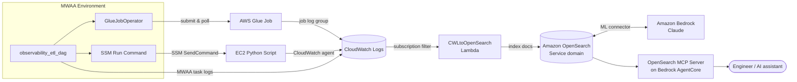

# Monitoring MWAA-Orchestrated ETL Pipelines with Amazon OpenSearch Service

---

## 1. Introduction

Modern data platforms rarely live in a single service. A typical MWAA-orchestrated ETL pipeline might kick off an AWS Glue job to extract and transform raw data and, in parallel, hand off to a Python script running on an EC2 instance for custom, stateful computation. Each of those components writes logs — but to completely different places. Glue logs land in a Glue job log group in CloudWatch Logs. EC2 scripts write to wherever the script author decided to send stdout. MWAA task logs are accessible through the Airflow UI or, once environment logging is enabled, in yet another CloudWatch log group.

The result is that when a pipeline run fails at 2 AM, the on-call engineer has to open several browser tabs, correlate timestamps by hand, and piece together what actually happened across Glue, EC2, and MWAA. There is no single place to ask "show me everything that happened during the last DAG run, and explain what went wrong."

This guide solves that problem by consolidating the logs from every pipeline component into a single Amazon OpenSearch Service domain and then layering a generative-AI query experience on top. Logs flow into CloudWatch Logs (the place each service already writes to), a CloudWatch Logs **subscription filter** streams them in near real time into a Lambda function, and that function indexes them into OpenSearch. From there, an OpenSearch **ML connector** to Amazon Bedrock and an **OpenSearch MCP server** hosted on Amazon Bedrock AgentCore let you investigate failures in plain English instead of hand-writing query DSL.

By the end of this guide you will have:

- An observable ETL pipeline orchestrated by MWAA, with Glue and EC2 compute paths that emit logs to CloudWatch Logs
- A near-real-time streaming path from CloudWatch Logs into Amazon OpenSearch Service via a subscription filter and a forwarding Lambda function
- An Amazon OpenSearch Service domain (OpenSearch 3.5) with fine-grained access control
- An Amazon Bedrock ML connector registered in OpenSearch for LLM-based analysis
- An OpenSearch MCP server, hosted on Amazon Bedrock AgentCore, that lets an AI assistant query your logs in natural language

---

## 2. Architecture Overview

### End-to-End Data Flow

The diagram below (also available as `ObservabilityArchitecture.drawio.png`) shows how logs flow from each pipeline component into OpenSearch and then to an AI-driven query experience.



### Component Roles

**MWAA DAG (`observability_etl_dag`)** — The orchestrator. It runs two tasks *in parallel* with no dependency between them: a Glue job and an EC2 script. MWAA is configured with environment logging enabled (DAG processing, scheduler, task, webserver, and worker logs), so its task logs land in CloudWatch Logs automatically.

**AWS Glue Job (`ObservabilityBlogETL`)** — Reads an XLSX file from S3, drops the `region` field from each record, and writes the result back to S3 as JSON. The job script uses Python's standard `logging` module; when it runs inside Glue, the framework routes that output to the job's CloudWatch Logs group (`/aws-glue/jobs/ObservabilityBlogETL`).

**EC2 Python Script** — Runs the same transformation as a parallel compute path, invoked by MWAA through SSM Run Command. The unified **CloudWatch agent** on the instance tails `/var/log/etl/etl.log` and ships it to the `/observability-blog/ec2-etl` log group.

**CloudWatch Logs** — The common landing zone. Every component already writes here natively (Glue job group, MWAA task group, EC2 via the CloudWatch agent), so no custom log-shipping library is required in the compute code.

**CloudWatch Logs Subscription Filter → `CWLtoOpenSearch` Lambda** — The bridge between log storage and search. A subscription filter on the selected log groups streams new log events, as they arrive, to a Lambda function (`CWLtoOpenSearch`). The Lambda writes each event into OpenSearch. Because this is a streaming subscription rather than a copy job, logs are indexed in near real time and never duplicated into a separate store.

**Amazon OpenSearch Service domain** — The central, searchable log store (OpenSearch 3.5). It is created with fine-grained access control (FGAC) and an internal master user.

**Amazon Bedrock ML Connector** — Registered inside OpenSearch, this connector lets OpenSearch call an Amazon Bedrock model (Claude) for LLM-based inference over the indexed logs.

**OpenSearch MCP Server (on Amazon Bedrock AgentCore)** — Exposes the OpenSearch domain as a set of Model Context Protocol tools so an AI assistant can search, count, and inspect indices through natural language. It is deployed as an AgentCore runtime fronted by Amazon Cognito for authentication.

### Why This Design

- **Meet each service where it already logs.** Glue, MWAA, and EC2 all have first-class CloudWatch Logs integration. Sending everything to CloudWatch first — then streaming to OpenSearch — means the compute code needs no bespoke logging library and no OpenSearch credentials.
- **Near-real-time, no duplication.** A subscription filter forwards events as they are written, so OpenSearch reflects the pipeline's state within seconds without a batch copy.
- **AI-native investigation.** With the logs in OpenSearch and a Bedrock ML connector plus an MCP server on top, an engineer can ask "what failed in the last run and why?" instead of learning query DSL.

---

## 3. Prerequisites

### AWS Services

This solution provisions and uses the following services:

- **Amazon MWAA** — managed Airflow environment (this workshop deploys Airflow 2.10.3)
- **AWS Glue** — the extraction/transformation job
- **Amazon EC2** — the parallel custom-processing script
- **AWS Lambda** — the `CWLtoOpenSearch` forwarder and CloudFormation custom-resource helpers
- **Amazon CloudWatch Logs** — the common log landing zone and the subscription-filter source
- **Amazon OpenSearch Service** — the central log store (OpenSearch 3.5, FGAC enabled)
- **Amazon Bedrock** — the LLM (Claude) behind the OpenSearch ML connector, and Bedrock AgentCore for the MCP server runtime
- **Amazon SageMaker** — a notebook instance used to drive the workshop and register the ML connector
- **Amazon Cognito** — authentication for the AgentCore-hosted MCP server
- **AWS Secrets Manager** — stores the OpenSearch master-user credentials

### Deployment Model

Everything is deployed through three CloudFormation stacks (see Section 6). You do **not** need to install a logging library into Glue, Lambda, or EC2 — logging is handled by each service's native CloudWatch integration plus the streaming Lambda.

---

## 4. The ETL Pipeline and Its Logs

### What the Pipeline Does

The `etl.yaml` stack provisions a deliberately simple but fully observable ETL pipeline so that the focus stays on the observability layer:

1. An **XLSX file** (`blog_sales_data.xlsx`) is seeded into an S3 bucket.
2. The **MWAA DAG** (`observability_etl_dag`) triggers two tasks in parallel:
   - `run_glue_job` — a `GlueJobOperator` that runs the `ObservabilityBlogETL` Glue job.
   - `run_ec2_etl` — an `SsmRunCommandOperator` (with a `BashOperator` fallback for older Airflow) that runs `etl_script.py` on the EC2 instance.
3. Both compute paths perform the same transformation — read the XLSX, drop the `region` column, and write JSON output back to S3.

The Glue job script and the EC2 script are both embedded in the `etl.yaml` template and uploaded to S3 by CloudFormation custom-resource Lambdas at deploy time.

### Where the Logs Go

Each component logs to CloudWatch Logs through its native path:

| Component | How it logs | CloudWatch Logs group |
|---|---|---|
| Glue job | Python `logging` → Glue's built-in CloudWatch routing | `/aws-glue/jobs/ObservabilityBlogETL` |
| EC2 script | writes to `/var/log/etl/etl.log`, tailed by the CloudWatch agent | `/observability-blog/ec2-etl` |
| MWAA tasks | MWAA environment logging (task logs enabled) | `/airflow/<stack>-mwaa/Task` |

All three log groups are created with a 30-day CloudWatch Logs retention.

### The EC2 CloudWatch Agent Configuration

The EC2 instance's user data writes an `amazon-cloudwatch-agent.json` that tails the ETL log file into CloudWatch Logs, then starts the agent:

```json
{
  "logs": {
    "logs_collected": {
      "files": {
        "collect_list": [
          {
            "file_path": "/var/log/etl/etl.log",
            "log_group_name": "/observability-blog/ec2-etl",
            "log_stream_name": "{instance_id}",
            "timestamp_format": "%Y-%m-%d %H:%M:%S"
          }
        ]
      }
    }
  }
}
```

The EC2 instance role attaches the AWS-managed `CloudWatchAgentServerPolicy` so the agent can create log streams and put log events. No OpenSearch permission is granted to the compute roles — they only need to reach CloudWatch.

---

## 5. Streaming CloudWatch Logs into OpenSearch

### The Subscription-Filter Pattern

Rather than have each compute component ship logs to OpenSearch directly, this solution uses the well-established **CloudWatch Logs subscription filter → Lambda → OpenSearch** pattern:

1. A **subscription filter** is attached to a log group. It matches new log events (optionally against a filter pattern) and delivers them to a destination as they arrive.
2. The destination is the **`CWLtoOpenSearch` Lambda function**, which receives the gzipped, base64-encoded CloudWatch Logs payload, decodes it, and writes the individual log events into an OpenSearch index.
3. OpenSearch indexes the documents, making them immediately searchable in Dashboards and through the MCP server.

This keeps the compute code free of any OpenSearch client or credentials, and it means adding a new log source is just a matter of attaching another subscription filter.

### IAM for the Forwarding Path

The notebook role that configures this path is granted permission to create the forwarder and wire up the subscription filter — for example `logs:PutSubscriptionFilter`, `logs:DeleteSubscriptionFilter`, and management of the `CWLtoOpenSearch` Lambda and its `CWLtoOpenSearchLambdaRole`. These are scoped in `opensearch_cfn.yaml`:

```yaml
- Effect: Allow
  Action:
    - logs:PutSubscriptionFilter
    - logs:DeleteSubscriptionFilter
    - logs:DescribeSubscriptionFilters
  Resource:
    - !Sub 'arn:aws:logs:${AWS::Region}:${AWS::AccountId}:log-group:*'
    - !Sub 'arn:aws:logs:${AWS::Region}:${AWS::AccountId}:log-group:*:*'
- Effect: Allow
  Action:
    - lambda:CreateFunction
    - lambda:UpdateFunctionCode
    - lambda:GetFunction
    - lambda:AddPermission
  Resource:
    - !Sub 'arn:aws:lambda:${AWS::Region}:${AWS::AccountId}:function:CWLtoOpenSearch'
```

> Note: In this workshop the `CWLtoOpenSearch` Lambda and its subscription filter are created interactively from the SageMaker notebook rather than being declared as static CloudFormation resources. The `opensearch_cfn.yaml` stack grants the notebook role the permissions above so the notebook can create them.

---

## 6. Deploying the Solution

The solution is deployed as three CloudFormation stacks. In a Workshop Studio event these are launched for you; in your own account you deploy them from `assets/cfn/`.

### Stack 1 — OpenSearch domain and SageMaker notebook (`opensearch_cfn.yaml`)

Provisions the foundational search and exploration layer:

- **Amazon OpenSearch Service domain** — OpenSearch 3.5, `r6g.2xlarge.search`, EBS gp3 storage, node-to-node encryption, encryption at rest, and HTTPS enforced. Fine-grained access control is enabled with an internal user database.
- **SageMaker Notebook instance** — `ml.m5d.2xlarge`, IMDSv2 required, pre-loaded with the workshop lab notebook via a lifecycle configuration that downloads the workshop assets.
- **IAM roles** for the notebook and for Amazon Bedrock batch inference / model invocation.
- **AWS Secrets Manager secret** holding the OpenSearch master username and password.
- **S3 buckets** for data and access logs.

The domain's endpoint and the Dashboards URL are exported as stack outputs.

### Stack 2 — OpenSearch MCP server (`agentcore-mcp-server.yaml`)

Deploys the natural-language query runtime:

- **Amazon Bedrock AgentCore runtime** hosting the OpenSearch MCP server.
- **Amazon Cognito user pool** for OAuth authentication to the MCP server.
- **Amazon ECR repository** and an **AWS CodeBuild project** that build and push the MCP server container image.
- The domain endpoint is passed to the runtime via an `OPENSEARCH_URL` environment variable (imported from Stack 1).

### Stack 3 — Observability ETL pipeline (`etl.yaml`)

Provisions the pipeline that generates the logs:

- **VPC** with public and private subnets and a NAT Gateway for MWAA networking.
- **Amazon MWAA environment** (Airflow 2.10.3) running `observability_etl_dag`, with environment logging enabled.
- **AWS Glue ETL job** (`ObservabilityBlogETL`).
- **EC2 instance** running the parallel Python ETL script with the CloudWatch agent.
- **CloudWatch Logs groups** for Glue, MWAA tasks, and EC2 (30-day retention).
- **CloudFormation custom-resource Lambdas** that seed the XLSX input, the Glue script, and the DAG/requirements into S3.
- An **MWAA Serverless aggregation workflow** used later in the pipeline.

### Order of Operations

Deploy Stack 1 first (it exports the OpenSearch endpoint), then Stack 2 (the MCP server, which imports that endpoint) and Stack 3 (the ETL pipeline). The notebook in Stack 1 is then used to register the Bedrock ML connector and wire the `CWLtoOpenSearch` subscription-filter forwarding path.

---

## 7. Authentication and Access

### OpenSearch Fine-Grained Access Control

The OpenSearch domain uses **fine-grained access control (FGAC)** rather than an IAM-only model. Authorization is handled by OpenSearch's internal security plugin:

```yaml
AdvancedSecurityOptions:
  AnonymousAuthEnabled: False
  Enabled: True
  InternalUserDatabaseEnabled: True
  MasterUserOptions:
    MasterUserName: !Sub ${OpenSearchUsername}
    MasterUserPassword: !Sub ${OpenSearchPassword}
NodeToNodeEncryptionOptions:
  Enabled: True
EncryptionAtRestOptions:
  Enabled: True
  KmsKeyId: alias/aws/es
DomainEndpointOptions:
  EnforceHTTPS: True
  TLSSecurityPolicy: Policy-Min-TLS-1-2-2019-07
```

Because FGAC is enabled, the domain's resource-based access policy is intentionally set to open (`Principal: '*'`, `Action: 'es:*'`) — all real authorization is enforced by the internal security plugin using the master user and backend roles. Encryption at rest, node-to-node encryption, and HTTPS are all required.

### Secrets Manager

The OpenSearch **master-user credentials** (username and password) are stored in an AWS Secrets Manager secret created by `opensearch_cfn.yaml`. This is what the notebook and the forwarding path use to authenticate to the domain. The domain **endpoint** itself is not a secret — it is published as a CloudFormation output/export and passed to the MCP server as the `OPENSEARCH_URL` environment variable.

> Security note: The `OpenSearchPassword` parameter has no default — you must supply a strong password at deploy time, and it is never stored in source control. The parameter is declared `NoEcho` and enforces a length/complexity pattern. The CloudFormation stacks provision their own scoped service and execution roles (MWAA execution role, notebook role, Bedrock inference role, and so on); review and tighten these to your organization's least-privilege requirements before deploying into a production account.

---

## 8. Querying Logs with Natural Language Using the OpenSearch MCP Server

Once logs are flowing into OpenSearch, you can query them using natural language through the OpenSearch MCP Server — a Model Context Protocol server that lets AI assistants interact directly with your OpenSearch cluster. In this solution the MCP server is deployed as an Amazon Bedrock AgentCore runtime (Stack 2), and OpenSearch is backed by an Amazon Bedrock ML connector so the model can reason over the indexed logs.

### What the OpenSearch MCP Server Does

The MCP server exposes your OpenSearch cluster as a set of tools that any MCP-compatible AI assistant (such as the Strands Agents framework used in the workshop notebook, Amazon Kiro, or Claude Desktop) can call. Instead of writing query DSL by hand, you describe what you want in plain English; the assistant translates it into the correct query, executes it through the MCP tools, and summarizes the results.

| Tool | Description |
|---|---|
| `SearchIndexTool` | Search an index using natural language or DSL |
| `ListIndexTool` | List all indices with document counts and sizes |
| `IndexMappingTool` | Retrieve field mappings for an index |
| `ClusterHealthTool` | Check cluster health status |
| `CountTool` | Count documents matching a query |

### Connecting a Local MCP Client (Optional)

The AgentCore-hosted server is the primary path used in the workshop. If you also want to point a local MCP client (for example Amazon Kiro) at the same OpenSearch domain, you can run the open-source [`opensearch-mcp-server-py`](https://github.com/opensearch-project/opensearch-mcp-server-py) locally:

```json
{
  "mcpServers": {
    "opensearch-mcp": {
      "command": "uvx",
      "args": ["opensearch-mcp-server-py@latest"],
      "env": {
        "OPENSEARCH_URL": "https://YOUR-OPENSEARCH-ENDPOINT",
        "AWS_REGION": "us-east-1",
        "FASTMCP_LOG_LEVEL": "ERROR"
      },
      "disabled": false,
      "autoApprove": [
        "SearchIndexTool",
        "ListIndexTool",
        "IndexMappingTool",
        "ClusterHealthTool",
        "CountTool"
      ]
    }
  }
}
```

Replace `YOUR-OPENSEARCH-ENDPOINT` with your domain endpoint and configure the authentication that matches your domain's FGAC settings.

### Example Natural Language Queries

Once connected, you can ask questions like:

**"What errors occurred in the last Glue job run?"** — the assistant searches the indexed Glue log events for error-level entries and summarizes the failure, including the message and when it happened.

**"How many log events are in the index?"** — the assistant calls `CountTool` and reports the total document count.

**"Show me everything from the most recent DAG run."** — the assistant searches across the indexed MWAA, Glue, and EC2 log events for the relevant time window and returns a consolidated timeline.

### Why This Matters

Writing OpenSearch DSL requires knowing exact field names, query syntax, and aggregation structure. The MCP server removes that barrier — anyone on the team can investigate a failure, check error rates, or explore log patterns without knowing DSL. This is particularly useful for:

- **On-call engineers** diagnosing a 2 AM pipeline failure without looking up query syntax
- **Data engineers** exploring log patterns without switching to the Dashboards UI
- **Platform teams** building natural-language observability into internal tooling

For the complete tool reference and advanced configuration, see the [`opensearch-mcp-server-py` documentation](https://github.com/opensearch-project/opensearch-mcp-server-py).

---

## 9. Clean Up

This solution creates resources that incur cost — the OpenSearch domain, the MWAA environment, the SageMaker notebook, and a NAT Gateway are the primary drivers. When you are finished, delete the three CloudFormation stacks (in reverse dependency order: the ETL stack and MCP-server stack first, then the OpenSearch stack) to stop charges. Empty any S3 buckets that block stack deletion.
---

## 10. Conclusion

This guide built an observability layer for an MWAA-orchestrated ETL pipeline without adding a custom logging library to any compute component. By letting Glue, EC2, and MWAA log to CloudWatch Logs the way they already do, streaming those logs into Amazon OpenSearch Service through a subscription filter and a forwarding Lambda, and layering an Amazon Bedrock ML connector and an OpenSearch MCP server on top, you get a single place to search every pipeline log — and the ability to investigate failures in plain English.

### Suggested Next Steps

- Attach subscription filters to additional log groups (other Glue jobs, other Lambda functions) to bring more of your estate into the same OpenSearch domain.
- Build OpenSearch Dashboards visualizations (error counts over time, per-component volume) on top of the indexed logs.
- Add OpenSearch Alerting monitors to notify a channel when error volume spikes.
- Extend the MCP-driven experience with agents that not only find failures but suggest remediations.

---

## Repository Layout

| Path | Contents |
|---|---|
| `README.md` | This blog post |
| `assets/cfn/opensearch_cfn.yaml` | Stack 1 — OpenSearch domain + SageMaker notebook |
| `assets/cfn/agentcore-mcp-server.yaml` | Stack 2 — OpenSearch MCP server on Bedrock AgentCore |
| `assets/cfn/etl.yaml` | Stack 3 — MWAA + Glue + EC2 ETL pipeline |
| `assets/Lab-OpenSearch-Observability-v2.ipynb` | Workshop lab notebook |
| `content/` | Step-by-step workshop instructions |
| `ObservabilityArchitecture.drawio.png` | Architecture diagram |