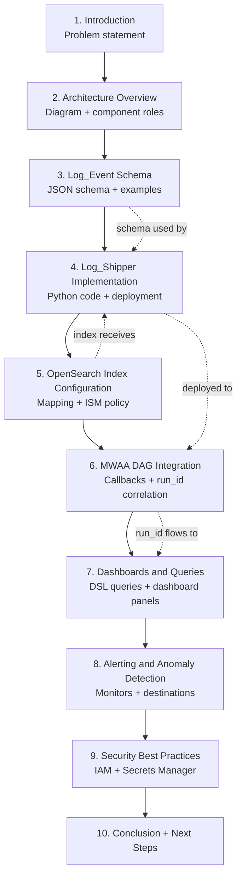
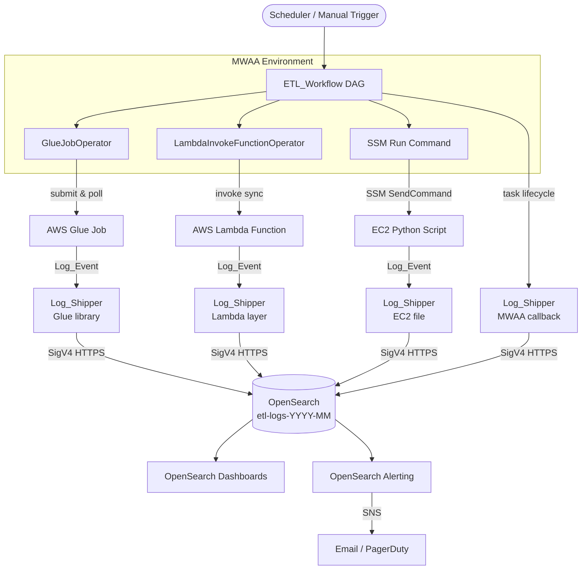

# Design Document: MWAA + OpenSearch Monitoring Blog

## Overview

This design describes the structure, content, and code artifacts for a technical blog post titled **"Monitoring MWAA-Orchestrated ETL Pipelines with Amazon OpenSearch Service"**. The blog teaches readers how to achieve full observability over a distributed ETL pipeline that spans Amazon MWAA, AWS Glue, AWS Lambda, and EC2-hosted Python scripts by centralizing structured log events in Amazon OpenSearch Service.

The blog is grounded in the concrete implementation described in the companion spec (`mwaa-etl-workflow`). Every code sample in the blog is drawn directly from that implementation, ensuring that readers can reproduce the solution without filling in gaps.

### Key Design Goals

- **Narrative coherence**: The blog follows a problem → architecture → implementation → visualization → alerting arc that mirrors how a practitioner would actually build the solution.
- **Completeness**: Every code snippet is runnable as-is; no pseudocode or partial fragments.
- **Security-first**: IAM least-privilege, SigV4 authentication, and Secrets Manager usage are woven throughout — not relegated to a single section.
- **Reproducibility**: All JSON configs, Python packages, and CLI commands are pinned and self-consistent.
- **Companion spec alignment**: All schemas, field names, IAM roles, and index configurations match the `mwaa-etl-workflow` design exactly.

---

## Architecture

### Blog Content Architecture

The blog is a single long-form technical post organized into eight major sections. The diagram below shows how the sections build on each other and which AWS services each section introduces.



### Reference Architecture Diagram (embedded in blog Section 2)

The blog embeds the following Mermaid diagram to illustrate the end-to-end monitoring flow:



---

## Components and Interfaces

### 3.1 Blog Sections

Each section maps to one or more requirements. The table below shows the mapping and the primary deliverable for each section.

| Section | Title | Requirements | Primary Deliverable |
|---|---|---|---|
| 1 | Introduction | 1.1 | Narrative prose explaining the monitoring problem |
| 2 | Architecture Overview | 1.2, 2.1–2.5 | Architecture diagram + component role descriptions |
| 3 | Prerequisites | 1.3 | Bulleted list of services, permissions, and package versions |
| 4 | Log_Event Schema Design | 3.1–3.6 | JSON schema + 4 example documents (one per component type) |
| 5 | Log_Shipper Implementation | 4.1–4.6 | Complete `LogShipper` Python class + deployment instructions |
| 6 | OpenSearch Index Configuration | 5.1–5.6 | Index mapping JSON + ISM policy JSON + CLI commands |
| 7 | MWAA DAG Integration | 6.1–6.5 | DAG callback code + `run_id` correlation explanation |
| 8 | Dashboards and Queries | 7.1–7.5 | 3 DSL queries + dashboard panel descriptions |
| 9 | Alerting and Anomaly Detection | 8.1–8.4 | Alert monitor config + anomaly detection setup |
| 10 | Security Best Practices | 9.1–9.5 | IAM policy examples + Secrets Manager code + VPC guidance |
| 11 | Reproducibility Reference | 10.1–10.6 | Package list + CLI commands + troubleshooting table |
| 12 | Conclusion | 1.5 | Summary + next steps |

### 3.2 Code Artifacts

The blog references the following code artifacts. Each must be complete and runnable.

| Artifact | Language | Section | Description |
|---|---|---|---|
| `log_event.py` | Python 3.9+ | 4 | `LogEvent` dataclass with all fields and `to_dict()` method |
| `log_shipper.py` | Python 3.9+ | 5 | `LogShipper` class with `ship()`, retry logic, SigV4 auth |
| `glue_job_example.py` | Python 3.9+ | 5 | Glue job script snippet showing `LogShipper` call-site |
| `lambda_handler_example.py` | Python 3.9+ | 5 | Lambda handler snippet showing `LogShipper` call-site |
| `ec2_script_example.py` | Python 3.9+ | 5 | EC2 script snippet showing `LogShipper` call-site |
| `etl_workflow_dag.py` (excerpt) | Python 3.9+ | 7 | DAG callbacks (`on_failure_callback`, summary log) |
| `index_mapping.json` | JSON | 6 | Complete OpenSearch index mapping |
| `ism_policy.json` | JSON | 6 | Complete ISM 30-day retention policy |
| `iam_policy_opensearch.json` | JSON | 10 | Least-privilege `es:ESHttpPost` IAM policy |
| `dsl_query_by_run_id.json` | JSON | 8 | DSL query: all events for a `run_id` |
| `dsl_query_errors.json` | JSON | 8 | DSL query: ERROR events in time range |
| `dsl_query_duration_agg.json` | JSON | 8 | DSL query: avg duration by `component_type` |
| `dsl_query_p95_duration.json` | JSON | 8 | DSL query: p95 duration by `component_type` |
| `alert_monitor.json` | JSON | 9 | OpenSearch alerting monitor config |

---

## Data Models

### 4.1 Log_Event Schema

The blog presents this schema in Section 4. It is identical to the schema in the `mwaa-etl-workflow` design to ensure consistency.

```json
{
  "$schema": "http://json-schema.org/draft-07/schema#",
  "type": "object",
  "required": [
    "run_id", "task_name", "component_type",
    "log_level", "message", "timestamp"
  ],
  "properties": {
    "run_id":          { "type": "string", "description": "MWAA DAG run ID — correlation key for all events in a single pipeline run" },
    "task_name":       { "type": "string", "description": "Airflow task_id that produced this event" },
    "component_type":  { "type": "string", "enum": ["glue", "lambda", "ec2", "mwaa"] },
    "log_level":       { "type": "string", "enum": ["INFO", "WARN", "ERROR"] },
    "message":         { "type": "string", "description": "Human-readable description of the event" },
    "timestamp":       { "type": "string", "format": "date-time", "description": "ISO 8601 UTC, e.g. 2024-03-15T10:30:00Z" },
    "job_name":        { "type": "string", "description": "Glue job name (glue only)" },
    "job_run_id":      { "type": "string", "description": "Glue job run ID (glue only)" },
    "terminal_status": { "type": "string", "description": "Glue terminal status: SUCCEEDED | FAILED | STOPPED (glue only)" },
    "function_name":   { "type": "string", "description": "Lambda function name (lambda only)" },
    "request_id":      { "type": "string", "description": "Lambda request ID (lambda only)" },
    "outcome":         { "type": "string", "enum": ["success", "error"], "description": "Lambda invocation outcome (lambda only)" },
    "instance_id":     { "type": "string", "description": "EC2 instance ID (ec2 only)" },
    "script_name":     { "type": "string", "description": "Script filename (ec2 only)" },
    "exit_code":       { "type": "integer", "description": "Script exit code (ec2 only)" },
    "start_time":      { "type": "string", "format": "date-time" },
    "end_time":        { "type": "string", "format": "date-time" },
    "duration_ms":     { "type": "integer", "description": "Duration in milliseconds" }
  }
}
```

### 4.2 Example Log_Event Documents

The blog provides one complete example per component type.

**Glue example:**
```json
{
  "run_id": "scheduled__2024-03-15T10:00:00+00:00",
  "task_name": "glue_extraction",
  "component_type": "glue",
  "log_level": "INFO",
  "message": "Glue job completed successfully",
  "timestamp": "2024-03-15T10:28:45Z",
  "job_name": "etl-extraction-job",
  "job_run_id": "jr_abc123def456",
  "terminal_status": "SUCCEEDED",
  "start_time": "2024-03-15T10:00:12Z",
  "end_time": "2024-03-15T10:28:45Z",
  "duration_ms": 1713000
}
```

**Lambda example:**
```json
{
  "run_id": "scheduled__2024-03-15T10:00:00+00:00",
  "task_name": "lambda_transform",
  "component_type": "lambda",
  "log_level": "INFO",
  "message": "Lambda function completed successfully",
  "timestamp": "2024-03-15T10:29:03Z",
  "function_name": "etl-transform-function",
  "request_id": "a1b2c3d4-e5f6-7890-abcd-ef1234567890",
  "outcome": "success",
  "start_time": "2024-03-15T10:28:47Z",
  "end_time": "2024-03-15T10:29:03Z",
  "duration_ms": 16000
}
```

**EC2 example:**
```json
{
  "run_id": "scheduled__2024-03-15T10:00:00+00:00",
  "task_name": "ec2_custom_script",
  "component_type": "ec2",
  "log_level": "INFO",
  "message": "EC2 script completed successfully",
  "timestamp": "2024-03-15T10:45:22Z",
  "instance_id": "i-0abc123def456789",
  "script_name": "custom_script.py",
  "exit_code": 0,
  "start_time": "2024-03-15T10:29:05Z",
  "end_time": "2024-03-15T10:45:22Z",
  "duration_ms": 977000
}
```

**MWAA example (DAG-level summary):**
```json
{
  "run_id": "scheduled__2024-03-15T10:00:00+00:00",
  "task_name": "dag_summary",
  "component_type": "mwaa",
  "log_level": "INFO",
  "message": "DAG run completed successfully",
  "timestamp": "2024-03-15T10:45:30Z",
  "overall_status": "success",
  "start_time": "2024-03-15T10:00:00Z",
  "end_time": "2024-03-15T10:45:30Z",
  "duration_ms": 2730000,
  "task_statuses": {
    "glue_extraction": "success",
    "lambda_transform": "success",
    "ec2_custom_script": "success"
  }
}
```

### 4.3 OpenSearch Index Mapping

```json
{
  "mappings": {
    "properties": {
      "run_id":          { "type": "keyword" },
      "task_name":       { "type": "keyword" },
      "component_type":  { "type": "keyword" },
      "log_level":       { "type": "keyword" },
      "message":         { "type": "text" },
      "timestamp":       { "type": "date" },
      "job_name":        { "type": "keyword" },
      "job_run_id":      { "type": "keyword" },
      "terminal_status": { "type": "keyword" },
      "function_name":   { "type": "keyword" },
      "request_id":      { "type": "keyword" },
      "outcome":         { "type": "keyword" },
      "instance_id":     { "type": "keyword" },
      "script_name":     { "type": "keyword" },
      "exit_code":       { "type": "integer" },
      "start_time":      { "type": "date" },
      "end_time":        { "type": "date" },
      "duration_ms":     { "type": "long" }
    }
  }
}
```

### 4.4 ISM Retention Policy

```json
{
  "policy": {
    "description": "ETL logs 30-day retention",
    "default_state": "hot",
    "states": [
      {
        "name": "hot",
        "actions": [],
        "transitions": [
          {
            "state_name": "delete",
            "conditions": { "min_index_age": "30d" }
          }
        ]
      },
      {
        "name": "delete",
        "actions": [{ "delete": {} }],
        "transitions": []
      }
    ],
    "ism_template": [
      {
        "index_patterns": ["etl-logs-*"],
        "priority": 100
      }
    ]
  }
}
```

### 4.5 DSL Query Examples

**Query 1 — All events for a specific `run_id`:**
```json
{
  "query": {
    "term": {
      "run_id": "scheduled__2024-03-15T10:00:00+00:00"
    }
  },
  "sort": [{ "timestamp": { "order": "asc" } }],
  "size": 100
}
```

**Query 2 — ERROR events in a time range:**
```json
{
  "query": {
    "bool": {
      "filter": [
        { "term": { "log_level": "ERROR" } },
        {
          "range": {
            "timestamp": {
              "gte": "2024-03-15T00:00:00Z",
              "lte": "2024-03-15T23:59:59Z"
            }
          }
        }
      ]
    }
  },
  "sort": [{ "timestamp": { "order": "desc" } }]
}
```

**Query 3 — Average task duration by `component_type`:**
```json
{
  "size": 0,
  "aggs": {
    "by_component": {
      "terms": { "field": "component_type" },
      "aggs": {
        "avg_duration_ms": { "avg": { "field": "duration_ms" } }
      }
    }
  }
}
```

**Query 4 — 95th-percentile duration by `component_type`:**
```json
{
  "size": 0,
  "aggs": {
    "by_component": {
      "terms": { "field": "component_type" },
      "aggs": {
        "p95_duration_ms": {
          "percentiles": {
            "field": "duration_ms",
            "percents": [95]
          }
        }
      }
    }
  }
}
```

---

## Error Handling

This section describes how the blog handles scenarios where readers may encounter errors when following the guide.

### 5.1 Troubleshooting Section (blog Section 11)

The blog includes a dedicated troubleshooting table covering the three most common failure modes:

| Issue | Likely Cause | Resolution |
|---|---|---|
| Log_Events not appearing in OpenSearch | IAM role missing `es:ESHttpPost` permission, or wrong index name | Verify IAM policy ARN matches the OpenSearch domain ARN; check `LogShipper` logs for HTTP 403 responses |
| SigV4 authentication errors (`AuthorizationException`) | `requests-aws4auth` not installed, wrong region, or IAM role not attached | Confirm `requests-aws4auth==1.3.1` is installed; verify `region` matches the OpenSearch domain region; check that the IAM role is attached to the compute resource |
| OpenSearch index mapping conflict | Attempting to index a field with a type that conflicts with the existing mapping | Delete and recreate the index with the correct mapping; use `strict` dynamic mapping to prevent future conflicts |

### 5.2 Code Sample Error Handling

Every code sample in the blog includes explicit error handling:
- The `LogShipper.ship()` method catches `requests.exceptions.RequestException` and retries with backoff.
- The Glue, Lambda, and EC2 call-site examples wrap the `ship()` call in a `try/except` block so that a log shipping failure does not crash the compute job.
- The DAG callback examples catch exceptions from `LogShipper` and log them to the Airflow task log rather than re-raising.

### 5.3 VPC Networking Guidance

For readers using VPC-deployed OpenSearch domains, the blog explains:
- Glue jobs must run in a VPC with a route to the OpenSearch VPC endpoint.
- Lambda functions must be deployed in the same VPC (or a peered VPC) with a security group rule allowing HTTPS (port 443) to the OpenSearch security group.
- EC2 instances must have a security group rule allowing HTTPS to the OpenSearch security group.
- MWAA environments must be deployed in a VPC with a route to the OpenSearch VPC endpoint.

---

## Testing Strategy

This spec produces a blog post (a content artifact), not a software system. Property-based testing is not applicable because there are no pure functions with universal input/output properties to verify. The appropriate quality assurance strategy is a combination of content review, code validation, and link checking.

**Why PBT does not apply**: The blog is a documentation artifact. Its "correctness" is measured by accuracy, completeness, and reproducibility — qualities that are verified by human review and by running the code samples, not by generating random inputs.

### Content Review Checklist

Each section is reviewed against its acceptance criteria before the blog is published:

- [ ] Every acceptance criterion in requirements.md is addressed by at least one section or code sample.
- [ ] All code samples include `import` statements and are compatible with Python 3.9+.
- [ ] All JSON documents are valid (parseable by `json.loads`).
- [ ] All field names in code samples match the `Log_Event` schema exactly (no typos, no renamed fields).
- [ ] All IAM policy ARNs use specific resource ARNs, not `*`.
- [ ] The `run_id` correlation key is explained and demonstrated in every relevant section.
- [ ] The troubleshooting section addresses all three required issues.
- [ ] Package versions are pinned (e.g., `requests-aws4auth==1.3.1`, `boto3>=1.34.0`).
- [ ] The minimum Airflow provider version is stated (`apache-airflow-providers-amazon>=8.0.0`).

### Code Sample Validation

All Python code samples are validated by running them in a test environment:

1. **`log_event.py` and `log_shipper.py`**: Run unit tests that instantiate `LogEvent` and `LogShipper`, call `ship()` against a mock OpenSearch endpoint, and verify the HTTP request contains a SigV4 `Authorization` header.
2. **Retry logic**: Unit test that mocks `requests.post` to fail N times and verifies the retry count and backoff delays match the specification (1 s, 2 s, 4 s).
3. **DAG callback examples**: Import the callback functions in a test DAG and verify they do not raise import errors.
4. **JSON configs**: Parse all JSON documents with `json.loads` to confirm validity.
5. **DSL queries**: Run each query against a local OpenSearch instance (via Docker) seeded with sample `Log_Event` documents and verify the response shape.

### Link and Reference Validation

- All AWS documentation links are verified to resolve to the correct page.
- All package names and versions are verified against PyPI.
- The companion spec (`mwaa-etl-workflow`) is cross-referenced to confirm all schemas, field names, and IAM role names are consistent.

### Unit Tests for Code Artifacts

The following unit tests validate the code samples embedded in the blog:

**`test_log_event.py`**:
- `LogEvent` with all required fields serializes to a valid JSON document.
- `LogEvent` with missing required fields raises `ValueError`.
- `timestamp`, `start_time`, `end_time` are validated as ISO 8601 UTC strings.
- `end_time >= start_time` is enforced.

**`test_log_shipper.py`**:
- `LogShipper.ship()` sends an HTTP POST to the correct OpenSearch endpoint.
- The request includes a SigV4 `Authorization` header (contains `AWS4-HMAC-SHA256`).
- The request does not include an `Authorization: Basic` header.
- When `requests.post` raises an exception once, `ship()` retries and succeeds on the second attempt.
- When `requests.post` raises an exception 4 times, `ship()` raises `LogShipperError` after exactly 4 attempts.
- Retry delays follow the 1 s / 2 s / 4 s exponential backoff pattern.

**`test_dsl_queries.py`** (integration, requires local OpenSearch):
- Query 1 returns only documents matching the specified `run_id`.
- Query 2 returns only documents with `log_level: ERROR` within the time range.
- Query 3 returns an aggregation with one bucket per `component_type`.
- Query 4 returns a percentile aggregation with a `95.0` key in each bucket.

**`test_json_configs.py`**:
- `index_mapping.json` is valid JSON and contains a `mappings.properties` key.
- `ism_policy.json` is valid JSON and contains a `policy.states` array with a `delete` state.
- `iam_policy_opensearch.json` is valid JSON and does not contain `"Resource": "*"`.
- `alert_monitor.json` is valid JSON and contains a `triggers` array.
